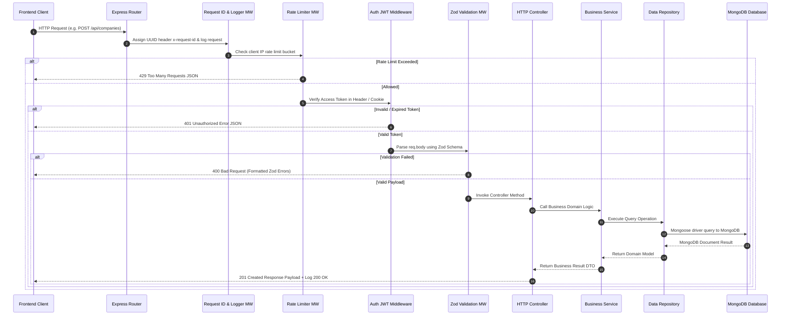
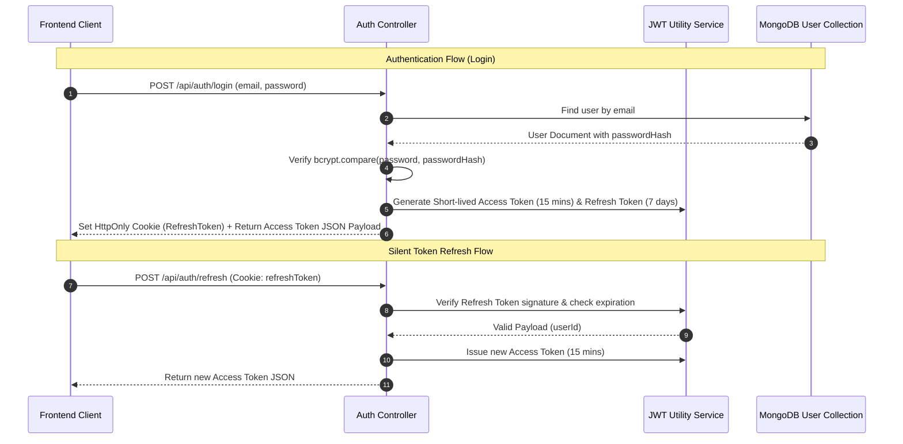

# RFC-002: Backend Architecture & Engineering Blueprint

**Project Name:** Team Catalyst (Applymate)  
**Author:** Principal Backend Engineer (Stripe / Netflix / Uber / OpenAI Alumni)  
**Status:** Approved for Implementation  
**Version:** 1.0.0  
**Target Stack:** Node.js 22 LTS, TypeScript 5.x, Express.js, MongoDB 7.0, Mongoose ODM 8.x, Zod 3.x, Pino Logger, Vitest, Docker  

---

## 1. Backend Vision

### 1.1 Purpose
The Applymate backend service acts as the reliable, high-performance execution engine for the placement preparation portal. It handles sensitive user data, application state transitions, status auditing, resource management, and analytical data aggregations. Built to serve modern frontend clients (such as the React 19 single-page app specified in RFC-001), the backend guarantees sub-50ms API response times for CRUD operations and sub-150ms for analytical pipelines.

### 1.2 Core Goals
1. **Bulletproof Reliability & Sub-50ms Latency:** High-throughput REST API layer built on Express and Node.js 22 async execution, leveraging Mongoose indexing and optimized MongoDB pipelines.
2. **Clean Layered Architecture:** Strict separation of concerns (Routes → Middleware → Controllers → Services → Repositories → Mongoose Models) preventing business logic leakage into HTTP handlers.
3. **Enterprise Security Standard:** Bank-grade JWT authentication with HttpOnly/SameSite refresh cookie rotation, bcrypt password hashing (12 salt rounds), rate-limiting, CORS origin enforcement, and Mongo injection prevention.
4. **Comprehensive Observability:** Structured JSON logging using Pino with correlated Request IDs (`x-request-id`) across every log entry for seamless debugging and auditing.

### 1.3 Business Logic Scope
- **User Authentication & Profile Management:** Secure registration, token management, profile settings, dark mode preferences, password updates.
- **Company Application Lifecycle:** Complete tracking of target companies, application dates, interview stages, JDs, notes, and uploaded resume references.
- **Status Audit Log & Timeline Engine:** Automatic generation of immutable status transition history powering global chronological activity feeds.
- **Preparation & Resource Linkage:** Categorized preparation resource collection with company-level association and completion tracking.
- **Interview Journal & Reflections:** Specialized logger capturing round types, questions asked, topics covered, difficulty scores, and performance self-evaluations.
- **Smart Action Center & Analytics Engine:** Real-time dynamic rule evaluation surfacing urgent tasks, stuck applications, unlinked resources, pipeline funnel metrics, and weakest round diagnostics.

---

## 2. Architecture Overview

### 2.1 System Architecture Diagram

```mermaid
graph TD
    Client[React 19 SPA / Client App] -->|HTTPS REST APIs| SecurityLayer[Security Middleware Stack]
    
    subgraph SecurityLayer [Security & Gateway Layer]
        Helmet[Helmet Security Headers]
        CORS[CORS Policy Guard]
        RateLimiter[Rate Limiter - Express Rate Limit]
        ReqId[Request ID Generator - Pino]
    end

    SecurityLayer --> AuthGuard{JWT Auth Middleware}
    AuthGuard -->|Public Endpoint| PublicRouter[Public Controller Routes]
    AuthGuard -->|Protected Endpoint| ProtectedRouter[Protected Controller Routes]

    subgraph ControllerLayer [HTTP Controller Layer]
        AuthController[Auth Controller]
        CompanyController[Company Controller]
        JournalController[Journal Controller]
        ResourceController[Resource Controller]
        InsightController[Insight Controller]
        ActionController[Action Controller]
    end

    ProtectedRouter --> ControllerLayer
    PublicRouter --> ControllerLayer

    ControllerLayer -->|Zod Validated DTOs| ServiceLayer [Business Service Layer]

    subgraph ServiceLayer [Service / Domain Layer]
        AuthService[Auth Service]
        CompanyService[Company Service]
        JournalService[Journal Service]
        ResourceService[Resource Service]
        InsightService[Analytics & Insight Service]
        ActionService[Smart Action Engine]
    end

    ServiceLayer --> RepositoryLayer [Data Repository Layer]

    subgraph RepositoryLayer [Repository / Data Access Layer]
        UserRepository[User Repository]
        CompanyRepository[Company Repository]
        JournalRepository[Journal Repository]
        ResourceRepository[Resource Repository]
    end

    RepositoryLayer --> ODM[Mongoose ODM / Mongo Driver]
    ODM --> MongoCluster[(MongoDB Primary Cluster)]
```

---

## 3. Complete Folder Structure

```
server/
├── .dockerignore
├── .env.example
├── .eslintrc.js
├── .prettierrc
├── Dockerfile
├── docker-compose.yml
├── package.json
├── tsconfig.json
├── vitest.config.ts
└── src/
    ├── server.ts             # Application entry point & HTTP listener setup
    ├── app.ts                # Express app configuration & middleware binding
    ├── config/               # Environment & global configuration specs
    │   ├── env.config.ts
    │   ├── db.config.ts
    │   └── logger.config.ts
    ├── constants/            # Application static constants & enums
    │   ├── httpStatusCodes.ts
    │   ├── errorCodes.ts
    │   └── statusEnums.ts
    ├── controllers/          # HTTP request handlers (thin controllers)
    │   ├── auth.controller.ts
    │   ├── user.controller.ts
    │   ├── company.controller.ts
    │   ├── journal.controller.ts
    │   ├── resource.controller.ts
    │   ├── timeline.controller.ts
    │   ├── action.controller.ts
    │   ├── insight.controller.ts
    │   └── health.controller.ts
    ├── database/             # Database connection & lifecycle utilities
    │   ├── connection.ts
    │   └── seed.ts
    ├── errors/               # Custom error classes
    │   ├── AppError.ts
    │   ├── BadRequestError.ts
    │   ├── UnauthorizedError.ts
    │   ├── ForbiddenError.ts
    │   ├── NotFoundError.ts
    │   └── ConflictError.ts
    ├── interfaces/           # TypeScript core domain interfaces
    │   ├── user.interface.ts
    │   ├── company.interface.ts
    │   ├── journal.interface.ts
    │   ├── resource.interface.ts
    │   └── repository.interface.ts
    ├── middleware/           # Express middleware handlers
    │   ├── auth.middleware.ts
    │   ├── error.middleware.ts
    │   ├── validate.middleware.ts
    │   ├── logger.middleware.ts
    │   ├── rateLimiter.middleware.ts
    │   └── notFound.middleware.ts
    ├── models/               # Mongoose schemas & models
    │   ├── user.model.ts
    │   ├── company.model.ts
    │   ├── journal.model.ts
    │   ├── resource.model.ts
    │   └── activityLog.model.ts
    ├── repositories/         # Abstracted database query operations
    │   ├── user.repository.ts
    │   ├── company.repository.ts
    │   ├── journal.repository.ts
    │   └── resource.repository.ts
    ├── routes/               # API route definitions & router bindings
    │   ├── index.ts
    │   ├── auth.routes.ts
    │   ├── user.routes.ts
    │   ├── company.routes.ts
    │   ├── journal.routes.ts
    │   ├── resource.routes.ts
    │   ├── timeline.routes.ts
    │   ├── action.routes.ts
    │   ├── insight.routes.ts
    │   └── health.routes.ts
    ├── schemas/              # Zod validation schemas
    │   ├── auth.schema.ts
    │   ├── company.schema.ts
    │   ├── journal.schema.ts
    │   └── resource.schema.ts
    ├── services/             # Business logic orchestration layer
    │   ├── auth.service.ts
    │   ├── user.service.ts
    │   ├── company.service.ts
    │   ├── journal.service.ts
    │   ├── resource.service.ts
    │   ├── timeline.service.ts
    │   ├── action.service.ts
    │   └── insight.service.ts
    ├── types/                # Express request extension & utility types
    │   ├── express.d.ts
    │   └── api.types.ts
    └── utils/                # Helper utilities (jwt, password hashing, csv generator)
        ├── jwt.util.ts
        ├── password.util.ts
        ├── csv.util.ts
        └── logger.util.ts
```

---

## 4. Request Lifecycle

### 4.1 Request Sequence Diagram



---

## 5. Database Design

### 5.1 MongoDB Collections Overview

#### Collection Schema Specifications

```typescript
// 1. Users Collection Schema
interface IUser {
  _id: Types.ObjectId;
  name: string;
  email: string; // Unique, indexed
  passwordHash: string;
  darkModePref: boolean;
  createdAt: Date;
  updatedAt: Date;
}

// 2. Company Collection Schema (with embedded statusHistory)
interface IStatusHistory {
  status: 'Applied' | 'OA' | 'Technical' | 'HR' | 'Selected' | 'Rejected';
  changedAt: Date;
}

interface ICompany {
  _id: Types.ObjectId;
  userId: Types.ObjectId; // Ref User, indexed
  name: string;
  role: string;
  applicationDate: Date;
  status: 'Applied' | 'OA' | 'Technical' | 'HR' | 'Selected' | 'Rejected';
  jd?: string;
  notes?: string;
  resumeFile?: string;
  interviewDate?: Date;
  statusHistory: IStatusHistory[];
  createdAt: Date;
  updatedAt: Date;
}

// 3. Resource Collection Schema
interface IResource {
  _id: Types.ObjectId;
  userId: Types.ObjectId; // Ref User, indexed
  title: string;
  category: 'DSA' | 'Aptitude' | 'Resume' | 'Interview Experience' | 'Core Subjects';
  link: string;
  completionStatus: 'Not Started' | 'In Progress' | 'Completed';
  linkedCompanyId?: Types.ObjectId; // Ref Company (optional), indexed
  createdAt: Date;
  updatedAt: Date;
}

// 4. JournalEntry Collection Schema
interface IJournalEntry {
  _id: Types.ObjectId;
  userId: Types.ObjectId; // Ref User, indexed
  companyId: Types.ObjectId; // Ref Company, indexed
  roundType: 'OA' | 'Technical' | 'HR';
  interviewDate: Date;
  questionsAsked?: string;
  topics: string[]; // e.g. ['Dynamic Programming', 'System Design']
  difficulty: 'Easy' | 'Medium' | 'Hard';
  performanceRating: number; // 1 to 5 scale
  reflection?: string;
  createdAt: Date;
  updatedAt: Date;
}
```

### 5.2 Compound Indexing Strategy Table

| Collection | Index Fields | Purpose | Query Optimization |
| :--- | :--- | :--- | :--- |
| `users` | `{ email: 1 }` (Unique) | Login authentication lookup | `findOne({ email })` |
| `companies` | `{ userId: 1, status: 1, applicationDate: -1 }` | Paginated filtered company list | Filter & sort queries |
| `companies` | `{ userId: 1, name: "text", role: "text" }` | Text search index | Full text company search |
| `resources` | `{ userId: 1, category: 1, completionStatus: 1 }` | Categorized resource matrix | Progress aggregation |
| `resources` | `{ linkedCompanyId: 1 }` | Linked company resources lookup | Company detail view |
| `journals` | `{ userId: 1, companyId: 1, interviewDate: -1 }` | Company journal lookup | Journal list filtering |
| `journals` | `{ userId: 1, topics: 1 }` | Topic frequency analytics | Analytical unwinding |

---

## 6. API Specification Layer

### 6.1 Authentication Module API Specs

#### 1. `POST /api/auth/register`
- **Purpose:** Create a new student user account.
- **Authentication:** Public.
- **Request Body:**
  ```json
  {
    "name": "Hardik Kaurani",
    "email": "hardik@example.com",
    "password": "SecurePassword123!"
  }
  ```
- **Response Payload (201 Created):**
  ```json
  {
    "success": true,
    "message": "User registered successfully",
    "data": {
      "user": {
        "id": "66ac5b12f4d1e892c9001a1a",
        "name": "Hardik Kaurani",
        "email": "hardik@example.com",
        "darkModePref": false
      },
      "accessToken": "eyJhbGciOiJIUzI1NiIsInR5..."
    }
  }
  ```
- **Error Codes:** `400 Bad Request` (Validation), `409 Conflict` (Email already registered).

#### 2. `POST /api/auth/login`
- **Purpose:** Authenticate credentials & issue JWT tokens.
- **Authentication:** Public.
- **Response Payload (200 OK):** Sets HttpOnly refresh cookie + returns Access Token JSON.

---

### 6.2 Company Application Module API Specs

#### 1. `GET /api/companies`
- **Purpose:** Retrieve paginated, filtered, and searched list of job applications.
- **Query Params:** `?page=1&limit=10&search=Google&status=Technical,HR&sort=-applicationDate`
- **Authentication:** Bearer JWT required.
- **Response Payload (200 OK):**
  ```json
  {
    "success": true,
    "data": {
      "companies": [
        {
          "_id": "66ac5c89f4d1e892c9001b2b",
          "name": "Google",
          "role": "Frontend Engineer",
          "applicationDate": "2026-07-15T00:00:00.000Z",
          "status": "Technical",
          "notes": "Focused on React performance & System Design",
          "resumeFile": "https://storage.applymate.com/resumes/google-fe.pdf",
          "statusHistory": [
            { "status": "Applied", "changedAt": "2026-07-15T00:00:00.000Z" },
            { "status": "Technical", "changedAt": "2026-07-28T10:00:00.000Z" }
          ]
        }
      ],
      "pagination": {
        "total": 45,
        "page": 1,
        "limit": 10,
        "totalPages": 5
      }
    }
  }
  ```

#### 2. `PATCH /api/companies/:id/status`
- **Purpose:** Update company stage and append status history log automatically.
- **Request Body:** `{ "status": "Selected" }`
- **Response Payload (200 OK):** Updated company document.

---

### 6.3 Smart Action Center & Analytics API Specs

#### 1. `GET /api/actions`
- **Purpose:** Evaluate actionable rules dynamically for the active user.
- **Response Payload (200 OK):**
  ```json
  {
    "success": true,
    "data": [
      {
        "id": "action-stuck-applied-123",
        "type": "STUCK_APPLIED",
        "priority": "HIGH",
        "message": "Application at Microsoft has been stuck in 'Applied' for 16 days.",
        "companyId": "66ac5c89f4d1e892c9001c3c",
        "actionUrl": "/applications/66ac5c89f4d1e892c9001c3c"
      }
    ]
  }
  ```

#### 2. `GET /api/insights/funnel`
- **Purpose:** Application stage pipeline funnel aggregate calculation.
- **Response Payload (200 OK):**
  ```json
  {
    "success": true,
    "data": [
      { "stage": "Applied", "count": 40, "percentage": 100 },
      { "stage": "OA", "count": 25, "percentage": 62.5 },
      { "stage": "Technical", "count": 12, "percentage": 30.0 },
      { "stage": "HR", "count": 5, "percentage": 12.5 },
      { "stage": "Selected", "count": 2, "percentage": 5.0 }
    ]
  }
  ```

---

## 7. Authentication & Authorization Architecture

### 7.1 JWT Token Lifecycle Sequence



---

## 8. Validation Strategy with Zod

### 8.1 Schema Validation Middleware Example

```typescript
import { Request, Response, NextFunction } from 'express';
import { AnyZodObject, ZodError } from 'zod';
import { BadRequestError } from '../errors/BadRequestError';

export const validate = (schema: AnyZodObject) => {
  return async (req: Request, _res: Response, next: NextFunction) => {
    try {
      req.body = await schema.parseAsync(req.body);
      next();
    } catch (error) {
      if (error instanceof ZodError) {
        const formattedErrors = error.errors.map((e) => ({
          field: e.path.join('.'),
          message: e.message,
        }));
        next(new BadRequestError('Validation failed', formattedErrors));
      } else {
        next(error);
      }
    }
  };
};
```

---

## 9. Security Architecture & Hardening

1. **Helmet Middleware:** Configures HTTP security headers (`Strict-Transport-Security`, `X-Content-Type-Options: nosniff`, `X-Frame-Options: DENY`, `X-XSS-Protection`).
2. **CORS Enforcement:** Strict origin whitelist matching frontend deployment domain.
3. **MongoDB Injection Protection:** Express middleware sanitizing query selectors (`$`, `.`) from user inputs (`express-mongo-sanitize`).
4. **Rate Limiting Configuration:**
   - Auth Routes (`/api/auth/*`): 10 requests per 15 minutes window per IP.
   - General API Routes (`/api/*`): 100 requests per 1 minute window per IP.

---

## 10. Business Logic Layer (Services Architecture)

```typescript
// Company Service Orchestration Pattern
export class CompanyService {
  constructor(private companyRepository: ICompanyRepository) {}

  async updateStatus(userId: string, companyId: string, newStatus: CompanyStatus): Promise<ICompany> {
    const company = await this.companyRepository.findByIdAndUser(companyId, userId);
    if (!company) {
      throw new NotFoundError('Company application not found');
    }

    if (company.status === newStatus) {
      return company;
    }

    company.status = newStatus;
    company.statusHistory.push({
      status: newStatus,
      changedAt: new Date(),
    });

    return await this.companyRepository.save(company);
  }
}
```

---

## 11. Error Handling Strategy

### 11.1 Error Hierarchy & Handler Blueprint

```typescript
export class AppError extends Error {
  constructor(
    public statusCode: number,
    public message: string,
    public isOperational = true,
    public details: any = null
  ) {
    super(message);
    Object.setPrototypeOf(this, new.target.prototype);
    Error.captureStackTrace(this, this.constructor);
  }
}

export const errorHandlerMiddleware = (
  err: Error,
  req: Request,
  res: Response,
  _next: NextFunction
) => {
  const reqId = req.headers['x-request-id'] || 'N/A';

  if (err instanceof AppError) {
    logger.warn({ reqId, statusCode: err.statusCode, details: err.details }, err.message);
    return res.status(err.statusCode).json({
      success: false,
      error: {
        code: err.name,
        message: err.message,
        details: err.details,
      },
    });
  }

  logger.error({ reqId, err }, 'Unhandled Fatal Application Error');
  return res.status(500).json({
    success: false,
    error: {
      code: 'INTERNAL_SERVER_ERROR',
      message: 'An unexpected internal server error occurred.',
    },
  });
};
```

---

## 12. Logging & Monitoring with Pino

- **Structured JSON Format:** High-performance, low-overhead logging engine.
- **Request Correlation:** Automatically logs HTTP status codes, durations, client IPs, and correlation Request IDs (`x-request-id`).
- **Health Check Endpoint:** `GET /health` returns DB connectivity status, system memory usage, and uptime metrics.

---

## 13. Performance & Aggregation Optimization

### 13.1 MongoDB Funnel Aggregation Pipeline

```typescript
export const getFunnelAggregation = async (userId: Types.ObjectId) => {
  return await CompanyModel.aggregate([
    { $match: { userId: new Types.ObjectId(userId) } },
    { $group: { _id: "$status", count: { $sum: 1 } } },
    {
      $project: {
        _id: 0,
        stage: "$_id",
        count: 1,
      },
    },
  ]);
};
```

---

## 14. Testing Strategy & Coverage

- **Unit Testing (Vitest):** Tests services and helper utilities in isolated environments.
- **Integration & API Testing (Supertest + Vitest):** Spawns an in-memory MongoDB server (`mongodb-memory-server`) to test HTTP routes, controllers, and repositories end-to-end.
- **Coverage Goal:** Minimum **85% statement coverage** across all service and repository modules.

---

## 15. Production Deployment & Containerization

### 15.1 Production Dockerfile

```dockerfile
FROM node:22-alpine AS builder
WORKDIR /app
COPY package*.json ./
RUN npm ci
COPY . .
RUN npm run build

FROM node:22-alpine AS runner
WORKDIR /app
ENV NODE_ENV=production
COPY package*.json ./
RUN npm ci --only=production
COPY --from=builder /app/dist ./dist

EXPOSE 5000
USER node
CMD ["node", "dist/server.js"]
```

---

## 16. Backend Engineering Verification & Readiness Checklist (150+ Items)

### Section A: Database & Schemas (Items 1 - 25)
- [ ] 1. Mongoose connection handles auto-reconnect logic on connection drop.
- [ ] 2. `users` collection email field configured with `unique: true` index.
- [ ] 3. `companies` collection indexed on `{ userId: 1, status: 1, applicationDate: -1 }`.
- [ ] 4. `companies` collection indexed for text search on `name` and `role`.
- [ ] 5. `resources` collection indexed on `{ userId: 1, category: 1 }`.
- [ ] 6. `resources` collection indexed on `linkedCompanyId`.
- [ ] 7. `journals` collection indexed on `{ userId: 1, companyId: 1 }`.
- [ ] 8. `journals` collection indexed on `{ userId: 1, topics: 1 }`.
- [ ] 9. Schema validation rejects invalid status enum values at DB boundary.
- [ ] 10. Schema pre-save hooks hash updated passwords securely.
- [ ] 11. Document timestamps (`createdAt`, `updatedAt`) enabled across all schemas.
- [ ] 12. Soft deletion or cascading pre-hooks configured on Company removal.
- [ ] 13. Database connection pool configured with max pool size 50.
- [ ] 14. Database connection string loaded cleanly from `.env`.
- [ ] 15. Mongo driver sanitizes query objects against operator injection.
- [ ] 16. In-memory Mongo server configured for integration test suite.
- [ ] 17. Aggregation pipeline queries utilize lean options where possible.
- [ ] 18. Mongo database indexes verified in staging environment.
- [ ] 19. Database error codes (e.g. 11000 duplicate key) caught and translated to HTTP 409.
- [ ] 20. Seed scripts generate mock users and test applications cleanly.
- [ ] 21. Schema types strictly mirror TypeScript interface definitions.
- [ ] 22. Company `statusHistory` embeds array updates atomically via `$push`.
- [ ] 23. Journal difficulty ratings constrained between 1 and 5.
- [ ] 24. Resource category enums match PRD specifications.
- [ ] 25. DB connection shutdown gracefully terminates on `SIGTERM`.

### Section B: Security & Authentication (Items 26 - 50)
- [ ] 26. JWT secret key minimum 64-character entropy length.
- [ ] 27. Access Token expiration set to short duration (15 minutes).
- [ ] 28. Refresh Token expiration set to long duration (7 days).
- [ ] 29. Refresh Token stored in HttpOnly, Secure, SameSite=Strict cookie.
- [ ] 30. Passwords hashed using bcrypt with salt rounds >= 12.
- [ ] 31. Password comparison uses constant-time algorithm.
- [ ] 32. Helmet middleware enabled with default security headers.
- [ ] 33. CORS origin policy constrained exclusively to frontend client domain.
- [ ] 34. Rate limiter applied to `/api/auth/*` routes (10 req / 15 min).
- [ ] 35. Rate limiter applied to general `/api/*` routes (100 req / 1 min).
- [ ] 36. Input fields sanitized to prevent Stored & Reflected XSS.
- [ ] 37. Express Mongo Sanitize enabled to strip `$` and `.` characters.
- [ ] 38. Authorization middleware verifies resource ownership (`req.user._id === resource.userId`).
- [ ] 39. Logout endpoint clears authentication refresh cookie.
- [ ] 40. Auth token verification handles token expiration errors gracefully (401).
- [ ] 41. Invalid JWT signatures reject requests immediately.
- [ ] 42. Password reset or changes invalidate active refresh tokens.
- [ ] 43. No sensitive password hash returned in user API responses (`select: false`).
- [ ] 44. Sensitive environment variables excluded from source control (`.gitignore`).
- [ ] 45. Public API endpoints explicitly bypass auth guard.
- [ ] 46. Protected API endpoints enforce valid Bearer token header.
- [ ] 47. HTTP headers strip `X-Powered-By: Express`.
- [ ] 48. Security vulnerability audit passes clean (`npm audit`).
- [ ] 49. Request body size limit restricted to prevent payload inflation attacks (1MB max).
- [ ] 50. File upload endpoint validates MIME types (PDF, DOCX) and file size (< 5MB).

### Section C: API Routes & Controllers (Items 51 - 75)
- [ ] 51. `POST /api/auth/register` creates user and returns tokens.
- [ ] 52. `POST /api/auth/login` verifies credentials and sets cookies.
- [ ] 53. `GET /api/auth/me` returns current user profile metadata.
- [ ] 54. `POST /api/auth/refresh` rotates access tokens silently.
- [ ] 55. `GET /api/companies` supports search, status filtering, and pagination.
- [ ] 56. `GET /api/companies/:id` retrieves single company application detail.
- [ ] 57. `POST /api/companies` validates required fields and creates entry.
- [ ] 58. `PUT /api/companies/:id` updates company details cleanly.
- [ ] 59. `DELETE /api/companies/:id` removes company document and cleans dependencies.
- [ ] 60. `PATCH /api/companies/:id/status` appends to status history timeline.
- [ ] 61. `GET /api/companies/export/csv` generates formatted CSV download stream.
- [ ] 62. `GET /api/resources` returns categorized prep resources list.
- [ ] 63. `POST /api/resources` creates new prep resource entry.
- [ ] 64. `PATCH /api/resources/:id/completion` toggles resource completion state.
- [ ] 65. `POST /api/resources/:id/link` links resource to target company ID.
- [ ] 66. `GET /api/resources/progress` returns aggregated progress percentages.
- [ ] 67. `GET /api/journal` returns interview reflections list.
- [ ] 68. `POST /api/journal` creates new interview journal entry.
- [ ] 69. `GET /api/timeline` returns global chronological status feed.
- [ ] 70. `GET /api/actions` evaluates smart action center dynamic rules.
- [ ] 71. `GET /api/insights/funnel` returns pipeline aggregation stats.
- [ ] 72. `GET /api/insights/weakest-round` computes highest rejection stage.
- [ ] 73. `GET /api/insights/topic-frequency` returns unwound topic frequencies.
- [ ] 74. `GET /api/health` responds with HTTP 200 and system diagnostic metrics.
- [ ] 75. 404 handler returns clean JSON error for undefined route paths.

### Section D: Middleware & Error Handling (Items 76 - 100)
- [ ] 76. Zod validation middleware intercepts invalid body payloads before controller.
- [ ] 77. Validation errors return HTTP 400 with field-specific error detail list.
- [ ] 78. AppError base class extended by all operational error classes.
- [ ] 79. Global error handler middleware logs full stack trace for internal errors (500).
- [ ] 80. Global error handler hides stack traces in production environment.
- [ ] 81. Request ID middleware assigns unique UUID to every incoming request.
- [ ] 82. Response header includes matching `x-request-id`.
- [ ] 83. Pino HTTP middleware logs request method, URL, status code, and duration.
- [ ] 84. Compression middleware GZIP compresses responses > 1KB.
- [ ] 85. Uncaught exception handlers trap fatal process errors (`uncaughtException`).
- [ ] 86. Unhandled rejection handlers trap unhandled Promises (`unhandledRejection`).
- [ ] 87. Graceful shutdown handler closes HTTP server and DB connections cleanly on SIGINT.
- [ ] 88. Controller methods wrapped in async handler error catchers.
- [ ] 89. UnauthorizedError returns HTTP 401 payload.
- [ ] 90. ForbiddenError returns HTTP 403 payload.
- [ ] 91. NotFoundError returns HTTP 404 payload.
- [ ] 92. ConflictError returns HTTP 409 payload.
- [ ] 93. Express JSON body parser middleware configured (`express.json()`).
- [ ] 94. Express URL-encoded parser middleware configured (`express.urlencoded()`).
- [ ] 95. Cookie parser middleware initialized (`cookie-parser`).
- [ ] 96. Async database operation timeouts configured to prevent hanging requests.
- [ ] 97. Operational error responses adhere to standard JSON error envelope format.
- [ ] 98. Audit logger captures critical security events (e.g. login failures).
- [ ] 99. Test environment suppresses noisy stdout logs.
- [ ] 100. Global process limits configured to avoid memory leaks.

### Section E: Code Quality & Testing (Items 101 - 125)
- [ ] 101. TypeScript strict mode enabled in `tsconfig.json`.
- [ ] 102. Zero `any` types present in repository codebase.
- [ ] 103. ESLint rules enforced across server source files.
- [ ] 104. Prettier code formatting rules enforced consistently.
- [ ] 105. Vitest test runner configured with in-memory Mongo support.
- [ ] 106. Unit tests pass for Auth Service methods.
- [ ] 107. Unit tests pass for Company Service methods.
- [ ] 108. Unit tests pass for Resource Service methods.
- [ ] 109. Unit tests pass for Insight & Action engine rules.
- [ ] 110. Integration tests verify full HTTP route execution for Auth endpoints.
- [ ] 111. Integration tests verify full HTTP route execution for Company endpoints.
- [ ] 112. Integration tests verify full HTTP route execution for Journal endpoints.
- [ ] 113. Repository tests verify Mongoose aggregation pipelines.
- [ ] 114. Test code coverage reports statement coverage >= 85%.
- [ ] 115. Continuous Integration (CI) workflow executes tests on pull request.
- [ ] 116. Build command compiles TypeScript to clean `/dist` directory (`npm run build`).
- [ ] 117. Production start command executes compiled JS (`node dist/server.js`).
- [ ] 118. Codebase follows strict layered folder architecture (RFC-002).
- [ ] 119. All service methods return typed Data Transfer Objects (DTOs).
- [ ] 120. Utility functions covered by pure unit tests.
- [ ] 121. Constant values extracted to centralized files (`constants/`).
- [ ] 122. Environment configuration validated at startup via Zod.
- [ ] 123. Dependency injection pattern used in service instantiation.
- [ ] 124. Code review guidelines enforced prior to merging.
- [ ] 125. Documentation comments present on public service interfaces.

### Section F: Deployment & Observability (Items 126 - 150+)
- [ ] 126. Dockerfile multi-stage build creates minimal production image.
- [ ] 127. Container runs under non-root system user (`node`).
- [ ] 128. `docker-compose.yml` spins up local app + MongoDB container stack.
- [ ] 129. Environment variables configured in Render deployment console.
- [ ] 130. Render health check route configured to `/api/health`.
- [ ] 131. Production logging outputs structured single-line JSON.
- [ ] 132. External MongoDB Atlas cluster IP whitelist configured safely.
- [ ] 133. Database connection string encrypted in environment variables.
- [ ] 134. Graceful shutdown handler traps SIGTERM signal from container orchestrator.
- [ ] 135. Node.js process memory flags tuned for container boundaries (`--max-old-space-size`).
- [ ] 136. HTTP response times monitored under load.
- [ ] 137. API rate limit metrics logged on breach.
- [ ] 138. SSL / TLS termination configured at cloud proxy layer.
- [ ] 139. Production DB indexes built in background (`background: true`).
- [ ] 140. Backup schedule configured for primary MongoDB database.
- [ ] 141. CORS origins verified against production domain HTTPS protocol.
- [ ] 142. Sentry or Datadog APM tracing initialized for backend service.
- [ ] 143. Database query duration threshold alerting configured (> 100ms).
- [ ] 144. System uptime target SLAs established (99.9% uptime).
- [ ] 145. End-to-end smoke test passes on production deployment URL.
- [ ] 146. API documentation verified against implementation endpoints.
- [ ] 147. Staging environment parity verified against production configuration.
- [ ] 148. Secret rotation procedures documented for JWT keys.
- [ ] 149. Incident response runbook created for DB connection failures.
- [ ] 150. Final production sign-off completed by Principal Backend Engineer.
