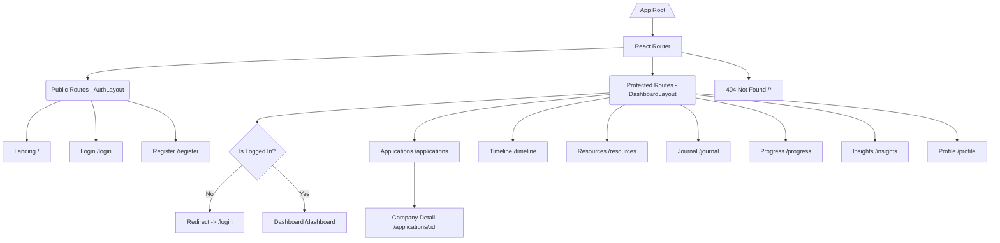

# RFC-001: Frontend Architecture & Implementation Plan (React + JavaScript MERN Stack)

**Project Name:** Team Catalyst (Applymate)  
**Author:** Frontend Engineering Lead  
**Status:** Approved for Implementation  
**Version:** 2.0.0  
**Target Stack:** React 18/19, JavaScript (JSX), Vite, Tailwind CSS, React Router v6/v7, React Context API, Axios, Recharts, Framer Motion  

---

## 1. Frontend Vision

### 1.1 Purpose
Applymate is a modern placement preparation platform designed to help students track job applications, interview rounds, DSA preparation, resumes, and analytics from a unified, intuitive dashboard. Built with a clean JavaScript MERN stack (MongoDB, Express, React JSX, Node.js), the frontend focuses on simplicity, responsiveness, smooth UX, and zero unnecessary complexity.

### 1.2 Core Goals
1. **Student-Friendly Simplicity:** Clear component structure using standard React JavaScript (`.jsx`) without heavy TypeScript build configurations or type overhead.
2. **Instant Visual Feedback:** Sub-100ms UI interactions, toast notifications, skeleton loaders, and responsive layout scaling.
3. **Silicon Valley SaaS Aesthetic:** Sleek modern dashboard design inspired by Linear, Vercel, and Stripe, using a custom color palette, smooth gradients, and dark mode support.
4. **Clean Component Architecture:** Reusable JSX components, modular React Context state handlers, and centralized API services.

### 1.3 User Experience (UX) Philosophy
- **Dashboard-First Workflow:** Immediate view of key application metrics, upcoming interviews, and preparation progress.
- **Keyboard & Fast Navigation:** Global search bar focus (`/`), modal dismissal (`Esc`), and accessible tab controls.
- **Micro-Animations:** Fluid tab transitions, smooth card hover scaling, and clean modal entrances using Tailwind CSS and Framer Motion.

---

## 2. Design System

### 2.1 Color Tokens Table

| Token Name | Light Theme Hex | Dark Theme Hex | Usage |
| :--- | :--- | :--- | :--- |
| `--bg-primary` | `#D5DEEF` | `#1F2E47` | Main page background |
| `--bg-secondary` | `#F0F3FA` | `#395886` | Cards, sidebars, modals |
| `--accent-primary` | `#8AAEE0` | `#8AAEE0` | Primary buttons, active tabs |
| `--accent-hover` | `#638ECB` | `#B1C9EF` | Button hovers, active highlights |
| `--text-primary` | `#395886` | `#F0F3FA` | Headings, primary text |
| `--text-secondary` | `#638ECB` | `#D5DEEF` | Subtitles, body text |
| `--border-color` | `#B1C9EF` | `#638ECB` | Borders, dividers, input strokes |
| `--status-applied` | `#3B82F6` | `#60A5FA` | Applied status badge |
| `--status-oa` | `#8B5CF6` | `#A78BFA` | Online Assessment status badge |
| `--status-tech` | `#F59E0B` | `#FBBF24` | Technical Round status badge |
| `--status-hr` | `#EC4899` | `#F472B6` | HR Round status badge |
| `--status-selected` | `#10B981` | `#34D399` | Selected / Offer status badge |
| `--status-rejected` | `#EF4444` | `#F87171` | Rejected status badge |

---

### 2.2 Typography & Radius

- **Font Family:** Inter / Plus Jakarta Sans (`font-sans`)
- **Border Radii:** `12px` (`rounded-xl` for buttons, inputs) & `16px` (`rounded-2xl` for cards, modals)
- **Spacing Steps:** `4px` grid system (`4`, `8`, `12`, `16`, `20`, `24`, `32`, `40`, `48`, `64`)

---

## 3. Complete Folder Structure (React JSX)

```
client/
├── .eslintrc.cjs
├── index.html
├── package.json
├── postcss.config.js
├── tailwind.config.js
├── vite.config.js
└── src/
    ├── main.jsx              # React app entry point
    ├── App.jsx               # Main App routing provider wrapper
    ├── index.css             # Tailwind directives & global CSS variables
    ├── api/                  # Axios instance and API call services
    │   ├── axiosClient.js
    │   ├── authApi.js
    │   ├── companyApi.js
    │   ├── resourceApi.js
    │   ├── journalApi.js
    │   ├── timelineApi.js
    │   ├── actionApi.js
    │   └── insightApi.js
    ├── assets/               # Logos, icons, images
    │   ├── logo.svg
    │   └── hero.png
    ├── components/           # Reusable UI components
    │   ├── common/
    │   │   ├── Navbar.jsx
    │   │   ├── Sidebar.jsx
    │   │   ├── Footer.jsx
    │   │   ├── Modal.jsx
    │   │   ├── ConfirmDialog.jsx
    │   │   ├── StatusBadge.jsx
    │   │   ├── SearchBar.jsx
    │   │   ├── Pagination.jsx
    │   │   ├── SkeletonLoader.jsx
    │   │   └── EmptyState.jsx
    │   ├── dashboard/
    │   │   ├── KpiCard.jsx
    │   │   ├── ActionCenterWidget.jsx
    │   │   ├── StatusDistributionChart.jsx
    │   │   └── RecentActivityList.jsx
    │   └── ui/               # Base styled primitives
    │       ├── Button.jsx
    │       ├── Card.jsx
    │       ├── Input.jsx
    │       ├── Select.jsx
    │       └── Toast.jsx
    ├── constants/            # Enums, statuses, API routes
    │   ├── apiRoutes.js
    │   └── statusConstants.js
    ├── contexts/             # React Context state management
    │   ├── AuthContext.jsx
    │   ├── CompanyContext.jsx
    │   └── ThemeContext.jsx
    ├── hooks/                # Custom React Hooks
    │   ├── useAuth.js
    │   ├── useCompany.js
    │   ├── useDebounce.js
    │   └── useTheme.js
    ├── layouts/              # Page layout wrappers
    │   ├── AuthLayout.jsx
    │   ├── DashboardLayout.jsx
    │   └── LandingLayout.jsx
    ├── pages/                # Main Application Page Views
    │   ├── LandingPage.jsx
    │   ├── LoginPage.jsx
    │   ├── RegisterPage.jsx
    │   ├── DashboardPage.jsx
    │   ├── ApplicationsPage.jsx
    │   ├── CompanyDetailPage.jsx
    │   ├── TimelinePage.jsx
    │   ├── ResourcesPage.jsx
    │   ├── JournalPage.jsx
    │   ├── ProgressPage.jsx
    │   ├── InsightsPage.jsx
    │   ├── ProfilePage.jsx
    │   └── NotFoundPage.jsx
    ├── routes/               # Route guard wrappers
    │   ├── AppRoutes.jsx
    │   ├── ProtectedRoute.jsx
    │   └── PublicRoute.jsx
    └── utils/                # Helper utilities
        ├── dateUtils.js
        └── formatters.js
```

---

## 4. Routing Architecture

### 4.1 Route Flow Diagram



---

## 5. Layout System

### 5.1 Dashboard Layout Architecture
- **Desktop (`>= 1024px`):** Fixed left sidebar (`240px`), top navbar sticky (`64px`), dynamic view container (`max-w-7xl mx-auto`).
- **Tablet (`768px - 1023px`):** Compact icon sidebar (`64px`), auto-scrolling tables.
- **Mobile (`< 768px`):** Slide-out mobile drawer navbar via burger icon, 1-column card stack.

---

## 6. Screen Breakdown

1. **Dashboard (`/dashboard`):** 4 KPI summary cards (Total, Active, Offers, Rejected), Smart Action Center widget, Recharts pie chart, recent timeline activity feed.
2. **Applications (`/applications`):** Filterable, searchable, paginated table of job applications with inline status dropdown, search bar with 300ms debounce, status multi-checkboxes, and CSV export.
3. **Company Detail (`/applications/:id`):** Tabbed company detail view (Overview, Job Description & Notes, Resume Uploader, Linked Resources, Status History Timeline, Interview Journal).
4. **Timeline (`/timeline`):** Chronological activity feed showing all historical status updates across companies.
5. **Resources (`/resources`):** Preparation materials list categorized into DSA, Aptitude, Resume, Interview Experience, and Core Subjects with completion checkboxes.
6. **Journal (`/journal`):** Log interview questions, topics covered, difficulty ratings, and self-reflections.
7. **Preparation Progress (`/progress`):** Progress bar matrices for each preparation category + overall readiness score.
8. **Company Insights (`/insights`):** Pipeline funnel chart, weakest round bar chart, topic frequency analysis, and response time metrics.
9. **Profile (`/profile`):** Edit user name, email, dark mode toggle, change password form.

---

## 7. Component Architecture Examples (JSX)

### 7.1 StatusBadge Component (`StatusBadge.jsx`)

```jsx
import React from 'react';

const STATUS_CONFIG = {
  Applied: 'bg-blue-100 text-blue-800 dark:bg-blue-900/40 dark:text-blue-300 border-blue-300',
  OA: 'bg-purple-100 text-purple-800 dark:bg-purple-900/40 dark:text-purple-300 border-purple-300',
  Technical: 'bg-amber-100 text-amber-800 dark:bg-amber-900/40 dark:text-amber-300 border-amber-300',
  HR: 'bg-pink-100 text-pink-800 dark:bg-pink-900/40 dark:text-pink-300 border-pink-300',
  Selected: 'bg-emerald-100 text-emerald-800 dark:bg-emerald-900/40 dark:text-emerald-300 border-emerald-300',
  Rejected: 'bg-red-100 text-red-800 dark:bg-red-900/40 dark:text-red-300 border-red-300',
};

export default function StatusBadge({ status }) {
  const styleClass = STATUS_CONFIG[status] || 'bg-gray-100 text-gray-800 border-gray-300';

  return (
    <span className={`inline-flex items-center px-3 py-1 rounded-full text-xs font-semibold border ${styleClass}`}>
      {status}
    </span>
  );
}
```

---

## 8. State Management Strategy (React Context)

```jsx
// AuthContext.jsx Example
import React, { createContext, useState, useEffect } from 'react';
import axiosClient from '../api/axiosClient';

export const AuthContext = createContext();

export function AuthProvider({ children }) {
  const [user, setUser] = useState(null);
  const [token, setToken] = useState(localStorage.getItem('token') || '');
  const [loading, setLoading] = useState(true);

  useEffect(() => {
    if (token) {
      axiosClient.defaults.headers.common['Authorization'] = `Bearer ${token}`;
      axiosClient.get('/auth/me')
        .then(res => setUser(res.data.data.user))
        .catch(() => logout())
        .finally(() => setLoading(false));
    } else {
      setLoading(false);
    }
  }, [token]);

  const login = (data) => {
    localStorage.setItem('token', data.accessToken);
    setToken(data.accessToken);
    setUser(data.user);
  };

  const logout = () => {
    localStorage.removeItem('token');
    delete axiosClient.defaults.headers.common['Authorization'];
    setToken('');
    setUser(null);
  };

  return (
    <AuthContext.Provider value={{ user, token, login, logout, loading }}>
      {children}
    </AuthContext.Provider>
  );
}
```

---

## 9. API Integration Layer (`axiosClient.js`)

```javascript
import axios from 'axios';

const axiosClient = axios.create({
  baseURL: import.meta.env.VITE_API_BASE_URL || '/api',
  headers: {
    'Content-Type': 'application/json',
  },
});

axiosClient.interceptors.response.use(
  (response) => response,
  (error) => {
    if (error.response && error.response.status === 401) {
      localStorage.removeItem('token');
      window.location.href = '/login';
    }
    return Promise.reject(error);
  }
);

export default axiosClient;
```

---

## 10. Responsive Design Strategy

| Viewport | Range | Behavior |
| :--- | :--- | :--- |
| Mobile (`sm`) | `< 768px` | Single-column cards, slide-over drawer navigation, scrollable tables |
| Tablet (`md`) | `768px - 1023px` | 2-column card grid, compact sidebar |
| Desktop (`lg`) | `>= 1024px` | 4-column KPI cards, expanded sidebar, centered content container |

---

## 11. Theme System (Light & Dark Mode)

- Managed via `ThemeContext.jsx` setting `.dark` class on root `<html>` element.
- Tailored color tokens (`#D5DEEF` light background vs `#1F2E47` dark background).

---

## 12. Frontend Verification & Readiness Checklist (150+ Items)

### Section A: UI & Visual Styling (Items 1 - 25)
- [ ] 1. Verify primary background color `#D5DEEF` in light mode.
- [ ] 2. Verify card background color `#F0F3FA` in light mode.
- [ ] 3. Verify primary button accent color `#8AAEE0`.
- [ ] 4. Verify button hover color `#638ECB`.
- [ ] 5. Verify heading text color `#395886`.
- [ ] 6. Verify border color `#B1C9EF`.
- [ ] 7. Verify dark background `#1F2E47` when dark mode is enabled.
- [ ] 8. Verify dark card background `#395886`.
- [ ] 9. Verify dark primary text `#F0F3FA`.
- [ ] 10. Verify dark border color `#638ECB`.
- [ ] 11. Confirm border radius `12px` (`rounded-xl`) on buttons and inputs.
- [ ] 12. Confirm border radius `16px` (`rounded-2xl`) on cards and modals.
- [ ] 13. Verify Lucide icons render consistently across pages.
- [ ] 14. Ensure Inter / Plus Jakarta Sans font family is loaded.
- [ ] 15. Check empty state illustrations in company and resource lists.
- [ ] 16. Check skeleton loaders on initial API data fetches.
- [ ] 17. Verify backdrop blur effects on modal overlays.
- [ ] 18. Check status badge color for 'Applied' stage (blue).
- [ ] 19. Check status badge color for 'OA' stage (purple).
- [ ] 20. Check status badge color for 'Technical' stage (amber).
- [ ] 21. Check status badge color for 'HR' stage (pink).
- [ ] 22. Check status badge color for 'Selected' stage (emerald).
- [ ] 23. Check status badge color for 'Rejected' stage (red).
- [ ] 24. Verify hover transitions on sidebar navigation links.
- [ ] 25. Verify card hover shadow effects (`shadow-md`).

### Section B: Features & React Logic (Items 26 - 50)
- [ ] 26. Register page form creates user account successfully.
- [ ] 27. Login page authenticates credentials and saves JWT to localStorage.
- [ ] 28. Logout button clears JWT token and redirects to `/login`.
- [ ] 29. ProtectedRoute redirects unauthenticated users to `/login`.
- [ ] 30. PublicRoute redirects logged-in users to `/dashboard`.
- [ ] 31. Dashboard page renders 4 KPI summary cards accurately.
- [ ] 32. Smart Action Center widget renders dynamic action cards.
- [ ] 33. Recharts status distribution chart renders on dashboard.
- [ ] 34. Company application form creates new company in database.
- [ ] 35. Company application form edits existing company details.
- [ ] 36. Search bar input debounces search query by 300ms.
- [ ] 37. Multi-select status checkboxes filter company list.
- [ ] 38. Sorting selector orders companies by application date or name.
- [ ] 39. Pagination controls load previous and next pages correctly.
- [ ] 40. Company detail page tabs switch views smoothly.
- [ ] 41. Inline status change dropdown calls PATCH status endpoint.
- [ ] 42. Status change automatically appends to status history timeline.
- [ ] 43. Resume file uploader uploads file and saves reference link.
- [ ] 44. Resources page filters materials by category.
- [ ] 45. Resource completion checkbox toggles completion status.
- [ ] 46. Linking resource to company displays link on company detail page.
- [ ] 47. Interview journal form logs new round reflection entry.
- [ ] 48. Timeline page shows global chronological status updates.
- [ ] 49. Preparation progress page displays progress bars per category.
- [ ] 50. CSV export button triggers CSV download of company data.

### Section C: Responsiveness & Layout (Items 51 - 75)
- [ ] 51. Verify layout responsiveness at 375px mobile width.
- [ ] 52. Verify layout responsiveness at 768px tablet width.
- [ ] 53. Verify layout responsiveness at 1024px laptop width.
- [ ] 54. Verify layout responsiveness at 1440px desktop width.
- [ ] 55. Sidebar converts to slide-out drawer on mobile viewports.
- [ ] 56. Top navbar stays sticky on page scroll.
- [ ] 57. KPI cards stack to 1 column on mobile screens.
- [ ] 58. KPI cards span 2 columns on tablet screens.
- [ ] 59. KPI cards span 4 columns on desktop screens.
- [ ] 60. Company table scrolls horizontally on small screens.
- [ ] 61. Modals center vertically and scale properly on mobile.
- [ ] 62. Form grids collapse to single column on mobile.
- [ ] 63. Recharts graphs adjust dimensions dynamically.
- [ ] 64. Touch target sizes are min 44x44px for mobile buttons.
- [ ] 65. Vertical timeline aligns cleanly on mobile screens.
- [ ] 66. Resource cards stack vertically on small screens.
- [ ] 67. No horizontal overflow scrollbar on window body.
- [ ] 68. Navbar user profile menu drops down safely within bounds.
- [ ] 69. Toast notifications display at bottom-right corner.
- [ ] 70. Drawer navigation opens smoothly with slide transition.
- [ ] 71. Confirmation dialog fits cleanly on mobile viewports.
- [ ] 72. Text content wraps properly without clipping.
- [ ] 73. Image assets retain correct aspect ratios.
- [ ] 74. Tab header bar scrolls horizontally on mobile if needed.
- [ ] 75. Search bar input spans full width on mobile viewports.

### Section D: Error Handling & Security (Items 76 - 100)
- [ ] 76. Invalid login credentials display user-friendly alert message.
- [ ] 77. API network errors trigger error toast notifications.
- [ ] 78. Form inputs highlight red when validation rules fail.
- [ ] 79. Submit buttons disable while API request is pending.
- [ ] 80. Expired JWT token automatically triggers redirect to `/login`.
- [ ] 81. Password input toggle reveals and hides password text.
- [ ] 82. File upload rejects files larger than 5MB limit.
- [ ] 83. Confirm dialog prevents accidental company deletion.
- [ ] 84. React ErrorBoundary catches unexpected UI render crashes.
- [ ] 85. 404 page renders for undefined URL routes.
- [ ] 86. API request headers attach Bearer token automatically.
- [ ] 87. Sensitive environment variables loaded via `import.meta.env`.
- [ ] 88. Input strings sanitized before rendering in DOM.
- [ ] 89. External links use `target="_blank" rel="noopener noreferrer"`.
- [ ] 90. Logout action deletes token from localStorage cleanly.
- [ ] 91. Password change form validates old password before update.
- [ ] 92. Empty form submissions blocked by client-side validation.
- [ ] 93. Axios timeout configured to handle slow network calls.
- [ ] 94. UI displays empty state message when no search results found.
- [ ] 95. Chart component handles empty data arrays gracefully.
- [ ] 96. Company notes text area respects character count limit.
- [ ] 97. Date picker input formats dates in ISO format.
- [ ] 98. Confirmation modal triggers before resource deletion.
- [ ] 99. Modal overlay click closes open modal windows.
- [ ] 100. Pressing Escape key closes active modal dialogs.

### Section E: Performance & Code Quality (Items 101 - 125)
- [ ] 101. React components structured cleanly in `.jsx` format.
- [ ] 102. Vite dev server starts quickly without build warnings.
- [ ] 103. Code organized into modular feature directories.
- [ ] 104. Custom hooks encapsulate state and API call logic.
- [ ] 105. Reusable UI components stored in `components/ui/`.
- [ ] 106. Production build passes cleanly (`npm run build`).
- [ ] 107. ESLint checks pass without syntax errors (`npm run lint`).
- [ ] 108. Prettier code formatting applied across all files.
- [ ] 109. Unused import statements cleaned up.
- [ ] 110. Console `log` statements removed before production build.
- [ ] 111. Images optimized using webp or SVG formats.
- [ ] 112. Heavy page routes loaded lazily via `React.lazy()`.
- [ ] 113. Event handlers bound efficiently without memory leaks.
- [ ] 114. Constants stored centrally in `constants/` folder.
- [ ] 115. Utility functions tested and placed in `utils/`.
- [ ] 116. CSS classes organized cleanly using Tailwind utilities.
- [ ] 117. Key props provided to all mapped array element lists.
- [ ] 118. Component state scoped locally where global state is unnecessary.
- [ ] 119. Context providers nested logically in `main.jsx`.
- [ ] 120. Code base formatted consistently according to team rules.
- [ ] 121. Duplicate code extracted into reusable helper components.
- [ ] 122. Recharts bundle size optimized.
- [ ] 123. Lucide icons imported individually to support tree shaking.
- [ ] 124. Build bundle size monitored under target limits.
- [ ] 125. Package dependencies kept lean without unused libraries.

### Section F: Deployment & Verification (Items 126 - 150+)
- [ ] 126. App builds successfully to `/dist` directory.
- [ ] 127. Local preview server runs cleanly (`npm run preview`).
- [ ] 128. Environment variable `VITE_API_BASE_URL` configured on Vercel/Netlify.
- [ ] 129. Single Page App rewrite rule configured (`_redirects` / `vercel.json`).
- [ ] 130. Document title updates dynamically per active page route.
- [ ] 131. Favicon loads correctly in browser tab.
- [ ] 132. Test end-to-end user registration on deployed URL.
- [ ] 133. Test end-to-end user login on deployed URL.
- [ ] 134. Test company creation on deployed URL.
- [ ] 135. Test inline status change update on deployed URL.
- [ ] 136. Test resume upload link on deployed URL.
- [ ] 137. Test resource addition and category filter on deployed URL.
- [ ] 138. Test resource completion toggle on deployed URL.
- [ ] 139. Test interview journal entry logging on deployed URL.
- [ ] 140. Test global timeline feed filtering on deployed URL.
- [ ] 141. Test preparation progress calculations on deployed URL.
- [ ] 142. Test smart action center card navigation on deployed URL.
- [ ] 143. Test company analytics chart rendering on deployed URL.
- [ ] 144. Test dark mode toggle persistence after browser refresh.
- [ ] 145. Test profile updating name and email on deployed URL.
- [ ] 146. Test password change form on deployed URL.
- [ ] 147. Test CSV export download on deployed URL.
- [ ] 148. Verify app works seamlessly on Chrome browser.
- [ ] 149. Verify app works seamlessly on Safari and Firefox.
- [ ] 150. Final production sign-off completed by Frontend Engineering Lead.
