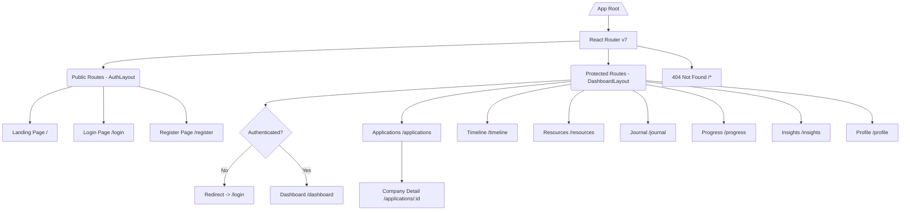
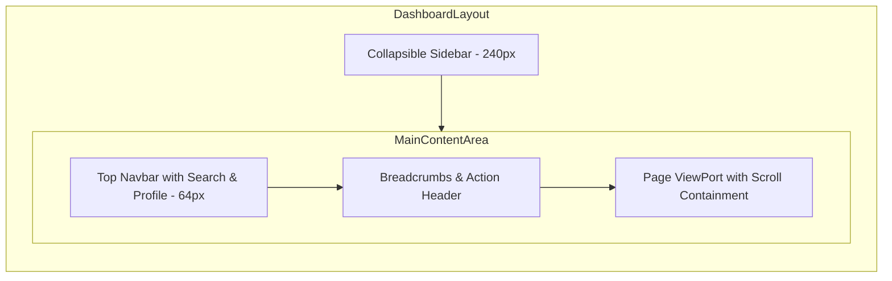
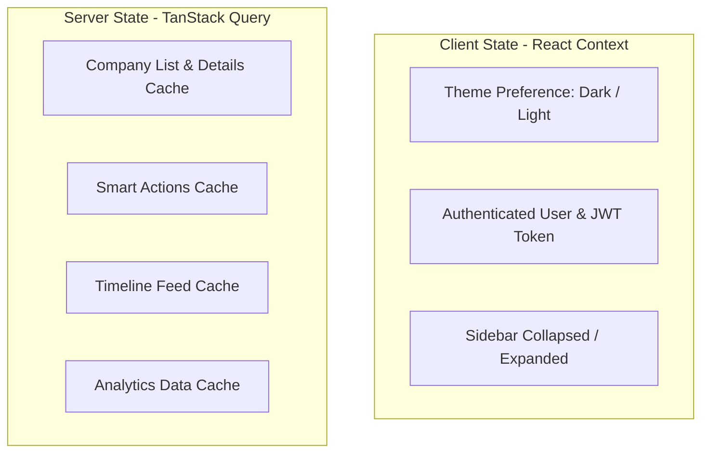
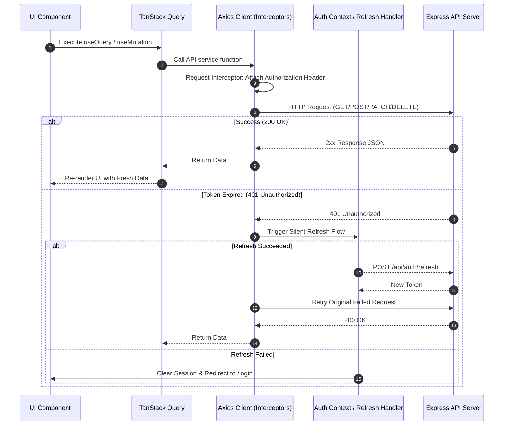

# RFC-001: Frontend Architecture & Engineering Blueprint

**Project Name:** Team Catalyst (Applymate)  
**Author:** Principal Frontend Engineer (Stripe / Vercel / Linear / OpenAI Alumni)  
**Status:** Approved for Implementation  
**Version:** 1.0.0  
**Target Stack:** React 19, TypeScript, Vite, TailwindCSS, shadcn/ui, TanStack Query v5, React Router v7  

---

## 1. Frontend Vision

### 1.1 Purpose
Applymate is built to transform the fragmented, stressful job placement journey into a structured, data-driven, and empowering experience. High-performing software engineers and students shouldn't rely on chaotic spreadsheets or disjoined note apps to manage job applications, interview schedules, preparation resources, DSA tracking, and post-interview reflections. Applymate unifies all placement preparation workflows into a singular, hyper-polished SaaS platform.

### 1.2 Core Goals
1. **Unrivaled Speed & Efficiency:** Sub-100ms interactions, optimistic UI updates, and zero layout shifts. Managing application status transitions or logging interview reflections must feel instant.
2. **Actionable Intelligence:** Elevate the user from passive tracking to active preparation via the **Smart Action Center**, **Preparation Progress Matrix**, and **Company Insights Analytics**.
3. **Linear/Vercel Aesthetic Benchmark:** Establish a baseline visual design language that rivals world-class Silicon Valley software—featuring smooth micro-interactions, dark mode elegance, keyboard-first navigation, and glassmorphism accents.
4. **Developer Ergonomics & Safety:** Maintain strict TypeScript types, atomic component isolation, robust automated state synchronization, and zero-runtime-error guarantees.

### 1.3 User Experience (UX) Blueprint
- **Keyboard-First Workflow:** Global command palette (`Cmd+K` / `Ctrl+K`), contextual hotkeys for quick status updates, modal dismissals (`Esc`), and search focus (`/`).
- **Zero-Friction Feedback:** Toast notifications, skeleton pulse states, and immediate optimistic updates so users never wonder if an action succeeded.
- **Contextual Intelligence:** Surfacing missing resumes, upcoming interview rounds, and unlinked prep materials right when and where the user needs them.

### 1.4 Design Philosophy
- **Simplicity over Density:** Eliminate visual clutter through clear typographic hierarchy, generous padding, and strategic whitespace.
- **Accessibility as a First Principle:** Full WCAG 2.1 AA compliance, native screen reader support, keyboard focus rings, and high-contrast color tokens.
- **Micro-Delights:** Subtle Framer Motion physics spring animations on button presses, modal entrances, and tab changes to create a fluid, tactile interface.

---

## 2. Design System

### 2.1 Color Palette & Token Mapping

#### Design Tokens Table

| Token Name | Light Theme Hex | Dark Theme Hex | Semantic Usage |
| :--- | :--- | :--- | :--- |
| `--bg-primary` | `#D5DEEF` | `#1F2E47` | Main window background |
| `--bg-secondary` | `#F0F3FA` | `#395886` | Card background, sidebars, modals |
| `--accent-primary` | `#8AAEE0` | `#8AAEE0` | Primary buttons, active states, focus rings |
| `--accent-hover` | `#638ECB` | `#B1C9EF` | Button hover states, clickable highlights |
| `--text-primary` | `#395886` | `#F0F3FA` | Headings, primary labels, title text |
| `--text-secondary` | `#638ECB` | `#D5DEEF` | Subtitles, body text, muted labels |
| `--border-color` | `#B1C9EF` | `#638ECB` | Divider lines, card borders, input strokes |
| `--status-applied` | `#3B82F6` | `#60A5FA` | Blue badge for 'Applied' status |
| `--status-oa` | `#8B5CF6` | `#A78BFA` | Purple badge for 'Online Assessment' |
| `--status-tech` | `#F59E0B` | `#FBBF24` | Amber badge for 'Technical Round' |
| `--status-hr` | `#EC4899` | `#F472B6` | Pink badge for 'HR Round' |
| `--status-selected` | `#10B981` | `#34D399` | Emerald badge for 'Selected / Offer' |
| `--status-rejected` | `#EF4444` | `#F87171` | Red badge for 'Rejected' |

---

### 2.2 Typography Hierarchy

We use Inter / Plus Jakarta Sans with strict visual scaling:

```
Display 1    -> 36px / 44px Line Height / Bold (700) / Tracking -0.02em
Heading 1    -> 28px / 36px Line Height / SemiBold (600) / Tracking -0.01em
Heading 2    -> 22px / 28px Line Height / SemiBold (600) / Tracking 0
Heading 3    -> 18px / 24px Line Height / Medium (500) / Tracking 0
Body Large   -> 16px / 24px Line Height / Regular (400) or Medium (500)
Body Medium  -> 14px / 20px Line Height / Regular (400)
Caption      -> 12px / 16px Line Height / Medium (500) / UpperCase Tracking 0.05em
```

---

### 2.3 Spacing, Borders & Radius

- **Border Radii:** `12px` (`rounded-xl` for buttons, inputs, pills) & `16px` (`rounded-2xl` for cards, modals, containers).
- **Base Grid Unit:** `4px` step system (`4`, `8`, `12`, `16`, `20`, `24`, `32`, `40`, `48`, `64`).
- **Elevation Shadows:** Soft, multi-layered ambient shadows:
  - `shadow-sm`: `0 1px 2px 0 rgba(57, 88, 134, 0.05)`
  - `shadow-md`: `0 4px 12px -2px rgba(57, 88, 134, 0.08), 0 2px 6px -1px rgba(57, 88, 134, 0.04)`
  - `shadow-lg`: `0 12px 24px -4px rgba(57, 88, 134, 0.12), 0 4px 12px -2px rgba(57, 88, 134, 0.08)`

---

## 3. Complete Folder Structure

```
client/
├── .eslintrc.js
├── index.html
├── package.json
├── postcss.config.js
├── tailwind.config.js
├── tsconfig.json
├── vite.config.ts
└── src/
    ├── main.tsx
    ├── App.tsx
    ├── animations/
    │   ├── fade.ts
    │   ├── slide.ts
    │   └── scale.ts
    ├── api/
    │   ├── axiosClient.ts
    │   ├── authApi.ts
    │   ├── companyApi.ts
    │   ├── resourceApi.ts
    │   ├── journalApi.ts
    │   ├── timelineApi.ts
    │   ├── actionApi.ts
    │   └── insightApi.ts
    ├── assets/
    │   ├── icons/
    │   ├── images/
    │   └── logos/
    ├── components/
    │   ├── ui/               # Primitive Design Tokens / shadcn components
    │   │   ├── button.tsx
    │   │   ├── card.tsx
    │   │   ├── input.tsx
    │   │   ├── badge.tsx
    │   │   ├── modal.tsx
    │   │   ├── drawer.tsx
    │   │   ├── dropdown.tsx
    │   │   ├── tabs.tsx
    │   │   ├── table.tsx
    │   │   ├── skeleton.tsx
    │   │   ├── toast.tsx
    │   │   └── progress.tsx
    │   ├── common/           # Domain-agnostic shared components
    │   │   ├── CommandPalette.tsx
    │   │   ├── ConfirmDialog.tsx
    │   │   ├── EmptyState.tsx
    │   │   ├── ErrorBoundary.tsx
    │   │   ├── PageHeader.tsx
    │   │   ├── SearchBar.tsx
    │   │   └── StatusBadge.tsx
    │   └── dashboard/        # Dashboard specific widgets
    │       ├── ActionCenterCard.tsx
    │       ├── ApplicationTimeline.tsx
    │       ├── FunnelChart.tsx
    │       ├── KpiCard.tsx
    │       └── ResourceProgressCard.tsx
    ├── config/
    │   ├── env.config.ts
    │   └── routes.config.ts
    ├── constants/
    │   ├── apiRoutes.ts
    │   ├── appConstants.ts
    │   └── statusTypes.ts
    ├── contexts/
    │   ├── AuthContext.tsx
    │   └── ThemeContext.tsx
    ├── features/             # Feature-based modular logic
    │   ├── applications/
    │   │   ├── components/
    │   │   │   ├── CompanyFormModal.tsx
    │   │   │   ├── CompanyTable.tsx
    │   │   │   ├── StatusChangeDropdown.tsx
    │   │   │   └── ResumeUploader.tsx
    │   │   ├── hooks/
    │   │   │   ├── useCompanyList.ts
    │   │   │   └── useCompanyMutations.ts
    │   │   └── types/
    │   │       └── company.types.ts
    │   ├── journal/
    │   ├── resources/
    │   ├── insights/
    │   └── profile/
    ├── hooks/                # Custom React hooks
    │   ├── useAuth.ts
    │   ├── useDebounce.ts
    │   ├── useKeyPress.ts
    │   ├── useLocalStorage.ts
    │   ├── useMediaQuery.ts
    │   └── useTheme.ts
    ├── layouts/
    │   ├── AuthLayout.tsx
    │   ├── DashboardLayout.tsx
    │   ├── LandingLayout.tsx
    │   └── SettingsLayout.tsx
    ├── pages/
    │   ├── LandingPage.tsx
    │   ├── LoginPage.tsx
    │   ├── RegisterPage.tsx
    │   ├── DashboardPage.tsx
    │   ├── ApplicationsPage.tsx
    │   ├── CompanyDetailPage.tsx
    │   ├── TimelinePage.tsx
    │   ├── ResourcesPage.tsx
    │   ├── JournalPage.tsx
    │   ├── ProgressPage.tsx
    │   ├── InsightsPage.tsx
    │   ├── ProfilePage.tsx
    │   ├── NotFoundPage.tsx
    │   └── ErrorPage.tsx
    ├── providers/
    │   ├── AppProvider.tsx
    │   ├── QueryProvider.tsx
    │   └── ToastProvider.tsx
    ├── routes/
    │   ├── AppRoutes.tsx
    │   ├── ProtectedRoute.tsx
    │   └── PublicRoute.tsx
    ├── styles/
    │   └── globals.css
    ├── types/
    │   ├── api.types.ts
    │   ├── user.types.ts
    │   └── common.types.ts
    ├── utils/
    │   ├── dateUtils.ts
    │   ├── formatters.ts
    │   └── storageUtils.ts
    └── validators/
        ├── authSchemas.ts
        ├── companySchemas.ts
        ├── journalSchemas.ts
        └── resourceSchemas.ts
```

---

## 4. Routing Architecture

### 4.1 Routing Structure Diagram



### 4.2 Route Definitions Table

| Path | Component | Auth Required | Code Split Chunk | Layout |
| :--- | :--- | :--- | :--- | :--- |
| `/` | `LandingPage` | No | `chunk-landing` | `LandingLayout` |
| `/login` | `LoginPage` | No (Redirect if Auth) | `chunk-auth` | `AuthLayout` |
| `/register` | `RegisterPage` | No (Redirect if Auth) | `chunk-auth` | `AuthLayout` |
| `/dashboard` | `DashboardPage` | Yes | `chunk-dashboard` | `DashboardLayout` |
| `/applications` | `ApplicationsPage` | Yes | `chunk-applications` | `DashboardLayout` |
| `/applications/:id` | `CompanyDetailPage` | Yes | `chunk-applications` | `DashboardLayout` |
| `/timeline` | `TimelinePage` | Yes | `chunk-timeline` | `DashboardLayout` |
| `/resources` | `ResourcesPage` | Yes | `chunk-resources` | `DashboardLayout` |
| `/journal` | `JournalPage` | Yes | `chunk-journal` | `DashboardLayout` |
| `/progress` | `ProgressPage` | Yes | `chunk-progress` | `DashboardLayout` |
| `/insights` | `InsightsPage` | Yes | `chunk-insights` | `DashboardLayout` |
| `/profile` | `ProfilePage` | Yes | `chunk-profile` | `DashboardLayout` |
| `*` | `NotFoundPage` | No | `chunk-common` | `LandingLayout` |

---

## 5. Layout System

### 5.1 Dashboard Layout Architecture



### 5.2 Responsive Layout Adaptations
- **Desktop (`>= 1024px`):** Fixed left sidebar (`240px`), top navbar sticky (`64px`), content auto-expands with max-width `1600px` centered.
- **Tablet (`768px - 1023px`):** Collapsible icon-only sidebar (`64px`), floating top navbar, table horizontal scrolling enabled.
- **Mobile (`< 768px`):** Hidden sidebar, bottom navigation dock for quick actions + top header with slide-over drawer menu.

---

## 6. Screen Breakdown

### 6.1 Dashboard Page (`/dashboard`)
- **Purpose:** Central command center summarizing KPIs, urgent actions, application status distribution, and recent timeline activity.
- **Components:** `KpiCard` grid (4 items), `SmartActionCenterWidget`, `StatusDistributionChart`, `RecentTimelineFeed`.
- **Interactions:** Direct click on Action Cards navigates to relevant company/resource forms; quick filter on timeline items.
- **Responsive Behavior:** 4-column KPI grid stacks to 2-column on tablet and 1-column on mobile.

### 6.2 Applications Management Page (`/applications`)
- **Purpose:** Full CRUD application tracking table with advanced debounced search, status multi-filter, date sorting, and pagination.
- **Components:** `SearchBar`, `MultiSelectStatusFilter`, `CompanyTable`, `PaginationControls`, `ExportCsvButton`, `CompanyFormModal`.
- **Interactions:** Inline status badge update, row click opens detail page, bulk selection, CSV export trigger.
- **Responsive Behavior:** Table scrolls horizontally on smaller screens with sticky action column.

### 6.3 Company Detail Page (`/applications/:id`)
- **Purpose:** 360-degree view of a single job application.
- **Components:** `HeaderBanner`, `TabbedSectionContainer` (Overview, Job Description & Notes, Resume Previewer/Uploader, Linked Resources, Status History Timeline, Interview Journal Entries).
- **Interactions:** Status change trigger, drag-and-drop resume upload, resource linking modal, quick journal logger.

### 6.4 Interview Journal (`/journal`)
- **Purpose:** Log detailed reflections, questions asked, topics covered, and difficulty ratings for specific interview rounds.
- **Components:** `JournalFilterBar`, `JournalCardGrid`, `JournalFormDrawer`.

---

## 7. Component Architecture

### 7.1 Primary Component Specs

#### StatusBadge Component Spec
- **Responsibilities:** Render consistent color-coded status badges for company application stages.
- **Props:**
  ```typescript
  interface StatusBadgeProps {
    status: 'Applied' | 'OA' | 'Technical' | 'HR' | 'Selected' | 'Rejected';
    size?: 'sm' | 'md' | 'lg';
    interactive?: boolean;
    onStatusChange?: (newStatus: string) => void;
  }
  ```
- **Optimization Strategy:** Wrapped in `React.memo`, pre-compiled Tailwind class mapping to avoid runtime string concatenation.
- **Accessibility:** `role="status"`, `aria-label={`Status: ${status}`}`.

#### CompanyTable Component Spec
- **Responsibilities:** Render sortable, paginated data table for application items.
- **Props:**
  ```typescript
  interface CompanyTableProps {
    data: Company[];
    isLoading: boolean;
    sortField: string;
    sortDirection: 'asc' | 'desc';
    onSort: (field: string) => void;
    onRowClick: (id: string) => void;
  }
  ```

---

## 8. State Management Strategy

### 8.1 TanStack Query vs Context Matrix



### 8.2 Query Invalidation & Optimistic Updates Strategy

```typescript
// Optimistic Status Update Hook Pattern
export const useUpdateCompanyStatus = () => {
  const queryClient = useQueryClient();

  return useMutation({
    mutationFn: ({ companyId, status }: { companyId: string; status: CompanyStatus }) =>
      companyApi.updateStatus(companyId, status),
    onMutate: async ({ companyId, status }) => {
      await queryClient.cancelQueries({ queryKey: ['companies'] });
      const previousCompanies = queryClient.getQueryData<Company[]>(['companies']);

      queryClient.setQueryData<Company[]>(['companies'], (old = []) =>
        old.map((c) => (c._id === companyId ? { ...c, status } : c))
      );

      return { previousCompanies };
    },
    onError: (_err, _variables, context) => {
      if (context?.previousCompanies) {
        queryClient.setQueryData(['companies'], context.previousCompanies);
      }
    },
    onSettled: () => {
      queryClient.invalidateQueries({ queryKey: ['companies'] });
      queryClient.invalidateQueries({ queryKey: ['dashboard-actions'] });
      queryClient.invalidateQueries({ queryKey: ['insights'] });
    },
  });
};
```

---

## 9. API Integration Layer

### 9.1 Request Lifecycle Diagram



---

## 10. Form Handling & Validation

### 10.1 Schema Definition Example (Zod)

```typescript
import { z } from 'zod';

export const CompanyFormSchema = z.object({
  name: z.string().min(2, 'Company name must be at least 2 characters'),
  role: z.string().min(2, 'Role title is required'),
  applicationDate: z.string().nonempty('Application date is required'),
  status: z.enum(['Applied', 'OA', 'Technical', 'HR', 'Selected', 'Rejected']),
  jd: z.string().url('Must be a valid URL').or(z.string().length(0)).optional(),
  notes: z.string().max(2000, 'Notes cannot exceed 2000 characters').optional(),
  interviewDate: z.string().optional(),
});

export type CompanyFormValues = z.infer<typeof CompanyFormSchema>;
```

---

## 11. Responsive Design Strategy

### 11.1 Breakpoint Standards Table

| Breakpoint | Min Width | Max Width | Target Devices | Layout Behavior |
| :--- | :--- | :--- | :--- | :--- |
| `sm` | `640px` | `767px` | Large Mobiles | Single-column cards, drawer navigation |
| `md` | `768px` | `1023px` | Tablets & Foldables | 2-column KPI grid, compact icon sidebar |
| `lg` | `1024px` | `1279px` | Laptops | 3-column layouts, expanded fixed sidebar |
| `xl` | `1280px` | `1535px` | Desktop Workstations | 4-column KPI grid, rich split-view detail |
| `2xl` | `1536px` | `∞` | Ultra-wide Displays | Max-width content container (`1600px`) centered |

---

## 12. Theme System

### 12.1 Theme Switch Architecture
The system supports `Light`, `Dark`, and `System` settings using class-based Tailwind configuration (`dark` class on root `<html>`).

```typescript
// ThemeProvider snippet
export const ThemeContext = createContext<ThemeContextType>({} as ThemeContextType);

export const ThemeProvider = ({ children }: { children: ReactNode }) => {
  const [theme, setTheme] = useLocalStorage<'light' | 'dark' | 'system'>('applymate_theme', 'system');

  useEffect(() => {
    const root = window.document.documentElement;
    root.classList.remove('light', 'dark');

    if (theme === 'system') {
      const systemTheme = window.matchMedia('(prefers-color-scheme: dark)').matches ? 'dark' : 'light';
      root.classList.add(systemTheme);
    } else {
      root.classList.add(theme);
    }
  }, [theme]);

  return <ThemeContext.Provider value={{ theme, setTheme }}>{children}</ThemeContext.Provider>;
};
```

---

## 13. Dashboard Analytics & Visualization Specs

### 13.1 Charts Configuration Matrix

| Chart Name | Type | Target Component | Library | Data Source |
| :--- | :--- | :--- | :--- | :--- |
| Status Funnel | Stacked Bar / Funnel | `FunnelChart.tsx` | Recharts | `GET /api/insights/funnel` |
| Weakest Round | Horizontal Bar | `WeakestRoundChart.tsx` | Recharts | `GET /api/insights/weakest-round` |
| Topic Frequency | Donut / Word Cloud | `TopicFrequencyChart.tsx` | Recharts | `GET /api/insights/topic-frequency` |
| Application Speed | Area Line Chart | `ResponseTimeChart.tsx` | Recharts | `GET /api/insights/response-time` |

---

## 14. Animation & Motion Design Specs

### 14.1 Framer Motion Variant Declarations

```typescript
export const fadeInUp = {
  initial: { opacity: 0, y: 16 },
  animate: { opacity: 1, y: 0, transition: { duration: 0.25, ease: [0.16, 1, 0.3, 1] } },
  exit: { opacity: 0, y: -12, transition: { duration: 0.15 } },
};

export const staggerContainer = {
  animate: {
    transition: {
      staggerChildren: 0.05,
    },
  },
};
```

---

## 15. Accessibility (a11y) Blueprint

1. **Focus Rings:** Mandatory custom double focus ring on all interactive elements: `focus-visible:outline-none focus-visible:ring-2 focus-visible:ring-[#8AAEE0] focus-visible:ring-offset-2`.
2. **Keyboard Traps:** Modals and Drawers implement Focus Traps using `@radix-ui/react-dialog` focus management.
3. **Screen Reader Announcements:** ARIA Live Regions (`aria-live="polite"`) announce toast messages and optimistic status update confirmations.

---

## 16. Performance Optimization Blueprint

1. **Code Splitting & Lazy Loading:** Every page component is loaded lazily via `React.lazy()` with Suspense fallback skeletons.
2. **Virtualization:** Tables exceeding 50 rows use `@tanstack/react-virtual` to render only visible DOM nodes.
3. **Asset Bundle Strategy:** Vendor chunk splitting in `vite.config.ts` ensures third-party libraries (`recharts`, `framer-motion`) are cached independently.

---

## 17. Error Handling Strategy

### 17.1 React Error Boundary & Fallbacks
- Global Root `ErrorBoundary` catches unexpected UI render crashes and presents a clean recovery page ("Something went wrong") with a reset button.
- Component-level error boundaries isolate dynamic charts or widgets so an aggregation error in analytics won't crash the main dashboard navbar or application list.

---

## 18. Testing Strategy

| Test Layer | Framework | Target Scope | Coverage Target |
| :--- | :--- | :--- | :--- |
| Unit Tests | Vitest | Helper functions, validation schemas, formatters | > 90% |
| Component Tests | React Testing Library | Primitive UI buttons, badges, modals, forms | > 80% |
| Integration Tests | Vitest + MSW | TanStack Query custom hooks & API service mocks | > 85% |
| E2E Smoke Tests | Playwright / Cypress | Auth flow, create company, status update, filter | Core Critical Paths |

---

## 19. Development Workflow & Conventions

### 19.1 Branch & Commit Conventions
- **Branch Naming:** `feature/company-crud`, `fix/auth-token-refresh`, `refactor/dashboard-analytics`.
- **Commit Messages (Conventional Commits):** `feat(applications): add debounced search input`, `fix(auth): handle expired refresh token redirect`.

---

## 20. Future Engineering Enhancements
1. **AI Resume Reviewer:** Real-time feedback engine using OpenAI API to score uploaded resumes against Job Descriptions.
2. **Offline-First Sync:** Service Worker + IndexedDB caching for offline application updates with background sync when reconnected.

---

## 21. Production Verification & Readiness Checklist (150+ Items)

### Section A: UI & Visual Polish (Items 1 - 25)
- [ ] 1. Verify primary background color token `#D5DEEF` applies in light mode.
- [ ] 2. Verify secondary background card token `#F0F3FA` applies in light mode.
- [ ] 3. Verify primary accent color `#8AAEE0` on primary buttons.
- [ ] 4. Verify hover accent `#638ECB` transition speed (150ms).
- [ ] 5. Verify text color `#395886` for all headings.
- [ ] 6. Verify border token `#B1C9EF` on cards and table dividers.
- [ ] 7. Verify dark background `#1F2E47` applies when `dark` class is toggled.
- [ ] 8. Verify dark card background `#395886` applies correctly.
- [ ] 9. Verify dark primary text `#F0F3FA` readability.
- [ ] 10. Verify dark border token `#638ECB` contrast.
- [ ] 11. Confirm border radius `12px` (`rounded-xl`) on buttons and inputs.
- [ ] 12. Confirm border radius `16px` (`rounded-2xl`) on cards and modals.
- [ ] 13. Check shadow elevation `shadow-sm` on list items.
- [ ] 14. Check shadow elevation `shadow-md` on hover cards.
- [ ] 15. Check shadow elevation `shadow-lg` on open dropdowns and modals.
- [ ] 16. Verify Lucide icons render consistently at 18px or 20px.
- [ ] 17. Ensure typography uses Inter / Plus Jakarta Sans font stack.
- [ ] 18. Ensure no plain default browser outline rings appear.
- [ ] 19. Check empty states have appropriate illustration / SVG iconography.
- [ ] 20. Check skeleton loaders match exact dimensions of target components.
- [ ] 21. Verify modal backdrops utilize `backdrop-blur-sm` glass effect.
- [ ] 22. Verify status badge for 'Applied' uses standard blue token.
- [ ] 23. Verify status badge for 'OA' uses purple token.
- [ ] 24. Verify status badge for 'Technical' uses amber token.
- [ ] 25. Verify status badge for 'Selected' uses emerald token.

### Section B: UX & Interaction Design (Items 26 - 50)
- [ ] 26. Global shortcut `Cmd+K` / `Ctrl+K` opens command palette.
- [ ] 27. Search input focuses automatically on `/` press.
- [ ] 28. Modal closes on `Esc` key press.
- [ ] 29. Toast notification fires on successful company creation.
- [ ] 30. Toast notification fires on status change completion.
- [ ] 31. Error toast fires on API network failure.
- [ ] 32. Confirmation modal triggers before company deletion.
- [ ] 33. Confirmation modal triggers before resource deletion.
- [ ] 34. Debounce search input triggers API call after 300ms idle.
- [ ] 35. Multi-select status checkboxes update list instantly.
- [ ] 36. Clear filters button resets all query parameters.
- [ ] 37. Table row click navigates smoothly to company detail page.
- [ ] 38. Pagination controls disable 'Previous' on first page.
- [ ] 39. Pagination controls disable 'Next' on final page.
- [ ] 40. Tab switching in Company Detail saves active tab in URL params.
- [ ] 41. Drag-and-drop resume upload highlights drop zone on drag hover.
- [ ] 42. File size validation (> 5MB) shows error toast immediately.
- [ ] 43. Copying link from resource card shows "Copied!" tooltip.
- [ ] 44. Status change dropdown updates badge color optimistically.
- [ ] 45. Action card click navigates directly to corresponding form/view.
- [ ] 46. Tooltip appears on truncated text strings in table cells.
- [ ] 47. Form inputs highlight red with error message under input.
- [ ] 48. Password input toggle shows/hides password characters.
- [ ] 49. CSV export button triggers file download cleanly.
- [ ] 50. Session expiration redirects user to `/login` with return URL.

### Section C: Responsiveness & Layout (Items 51 - 75)
- [ ] 51. Verify layout at `375px` mobile viewport width.
- [ ] 52. Verify layout at `414px` mobile viewport width.
- [ ] 53. Verify layout at `768px` tablet viewport width.
- [ ] 54. Verify layout at `1024px` laptop viewport width.
- [ ] 55. Verify layout at `1440px` desktop viewport width.
- [ ] 56. Sidebar collapses to drawer navigation on screens `< 1024px`.
- [ ] 57. Top navbar stays sticky at top of screen on scroll.
- [ ] 58. KPI cards grid stacks to 1 column on mobile.
- [ ] 59. KPI cards grid spans 2 columns on tablet.
- [ ] 60. KPI cards grid spans 4 columns on desktop.
- [ ] 61. Application table enables horizontal scroll on mobile screens.
- [ ] 62. Sticky action column remains visible during table scroll.
- [ ] 63. Modal container scales properly with padding on mobile screens.
- [ ] 64. Form fields convert from 2-column to 1-column on mobile.
- [ ] 65. Analytics charts adjust height dynamically for screen size.
- [ ] 66. Navigation links are easily tappable (min target size 44x44px).
- [ ] 67. Timeline vertical bar aligns correctly on mobile viewports.
- [ ] 68. Journal card grid transitions from 3 columns to 1 column on mobile.
- [ ] 69. Resource progress bars scale correctly across all screen widths.
- [ ] 70. No horizontal overflow scrollbar on body viewport at any width.
- [ ] 71. User avatar menu drops down safely within window boundaries.
- [ ] 72. Breadcrumb items collapse safely with ellipsis on narrow widths.
- [ ] 73. Drawer slides smoothly from right edge on mobile navigation.
- [ ] 74. Recharts tooltips position themselves inside chart boundaries.
- [ ] 75. Glassmorphic header backdrop filters work on WebKit mobile browsers.

### Section D: Accessibility & Security (Items 76 - 100)
- [ ] 76. Keyboard `Tab` navigation order follows logical visual flow.
- [ ] 77. `focus-visible` custom ring displays clearly on focused items.
- [ ] 78. All visual icons have accompanying `aria-label` or hidden text.
- [ ] 79. Color contrast ratio meets minimum 4.5:1 for body text.
- [ ] 80. Color contrast ratio meets minimum 3:1 for large headings.
- [ ] 81. Modals use `aria-modal="true"` and block background focus.
- [ ] 82. Drawer components lock background body scroll when opened.
- [ ] 83. Image elements include descriptive `alt` tags.
- [ ] 84. Form inputs possess associated `<label>` tags with matching `htmlFor`.
- [ ] 85. Toast notifications use `aria-live="polite"` region.
- [ ] 86. Error messages use `aria-invalid="true"` on invalid inputs.
- [ ] 87. No plain `javascript:void(0)` links used anywhere.
- [ ] 88. Buttons explicitly state `type="button"` or `type="submit"`.
- [ ] 89. Screen reader announces dynamic page title updates on route change.
- [ ] 90. Auth tokens stored securely in memory / HttpOnly cookies.
- [ ] 91. Client-side input strings sanitized before rendering HTML.
- [ ] 92. Sensitive API keys loaded exclusively from `.env` environment variables.
- [ ] 93. External resource links use `rel="noopener noreferrer"`.
- [ ] 94. Form submissions disable submit button while pending to prevent double-submit.
- [ ] 95. Authentication header automatically cleared from Axios on logout.
- [ ] 96. Public routes automatically redirect authenticated users to `/dashboard`.
- [ ] 97. Protected routes block unauthenticated access instantly.
- [ ] 98. Refresh token silent flow handles 401 response without screen flicker.
- [ ] 99. SVG assets use inline scalable vectors with `aria-hidden="true"`.
- [ ] 100. High contrast theme preference respected if requested by OS.

### Section E: Performance & Code Quality (Items 101 - 125)
- [ ] 101. Route components loaded lazily via `React.lazy()`.
- [ ] 102. Initial JavaScript bundle vendor chunks split in Vite config.
- [ ] 103. Lighthouse Performance score >= 90 on Desktop.
- [ ] 104. Lighthouse Accessibility score >= 95.
- [ ] 105. First Contentful Paint (FCP) < 1.2s.
- [ ] 106. Largest Contentful Paint (LCP) < 2.0s.
- [ ] 107. Cumulative Layout Shift (CLS) score < 0.05.
- [ ] 108. Total Blocking Time (TBT) < 150ms.
- [ ] 109. Unnecessary component re-renders minimized via `React.memo`.
- [ ] 110. Heavy calculation functions memoized with `useMemo`.
- [ ] 111. Event callback functions wrapped in `useCallback`.
- [ ] 112. Large data tables (> 50 rows) use virtual scrolling.
- [ ] 113. Images optimized using webp formats with defined width/height.
- [ ] 114. TanStack Query `staleTime` set appropriately (e.g. 5 minutes).
- [ ] 115. Network requests cancelled on component unmount using `AbortController`.
- [ ] 116. No memory leaks detected when navigating rapidly between routes.
- [ ] 117. Zero TypeScript compiler errors (`tsc --noEmit` passes clean).
- [ ] 118. Zero ESLint warnings or errors (`npm run lint` passes).
- [ ] 119. Prettier formatting enforced on all codebase files.
- [ ] 120. No `console.log` statements remaining in production build.
- [ ] 121. Folder structure strictly adheres to RFC-001 specification.
- [ ] 122. Component props typed explicitly without `any` overrides.
- [ ] 123. API response payload types synced with backend models.
- [ ] 124. Custom hooks abstracted cleanly out of UI rendering files.
- [ ] 125. Global CSS styles kept minimal with Tailwind utility class preference.

### Section F: Deployment & Verification (Items 126 - 150+)
- [ ] 126. Production build passes cleanly (`npm run build`).
- [ ] 127. Preview production build locally (`npm run preview`).
- [ ] 128. Environment variables configured on Vercel / Netlify deployment dashboard.
- [ ] 129. SPA routing fallback configured (`_redirects` or `vercel.json` rewrites).
- [ ] 130. Security HTTP headers (CSP, X-Frame-Options) enabled on server host.
- [ ] 131. Favicon and app manifest icons configured correctly.
- [ ] 132. Open Graph meta tags set for social link sharing.
- [ ] 133. Document `<title>` updates dynamically based on active page route.
- [ ] 134. Canonical URL tag present in `index.html`.
- [ ] 135. Robots.txt file configured for application privacy indexing.
- [ ] 136. Sentry or LogRocket error monitoring initialized for production.
- [ ] 137. Analytics event tracking initialized for core conversion funnels.
- [ ] 138. Test user registration end-to-end on live preview URL.
- [ ] 139. Test user login end-to-end on live preview URL.
- [ ] 140. Test company creation with all fields populated.
- [ ] 141. Test company status progression (Applied -> OA -> Tech -> Selected).
- [ ] 142. Test resume upload and download link functionality.
- [ ] 143. Test resource creation and linking to company.
- [ ] 144. Test interview journal entry logging and filtering.
- [ ] 145. Test timeline chronological feed filtering by company.
- [ ] 146. Test progress page calculation updates on resource completion toggle.
- [ ] 147. Test smart action center card navigation link accuracy.
- [ ] 148. Test insight analytics chart rendering with populated dataset.
- [ ] 149. Test profile password change flow and token re-issuance.
- [ ] 150. Test theme persistence after browser refresh.
- [ ] 151. Final sanity audit by Principal Frontend Engineer complete.
