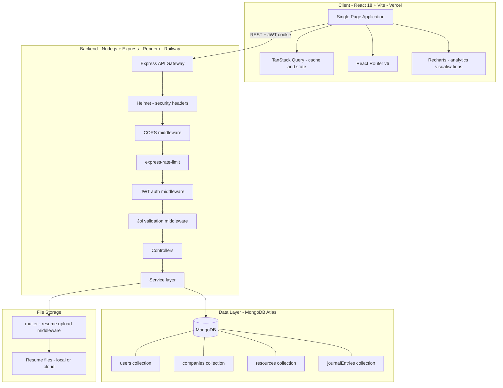
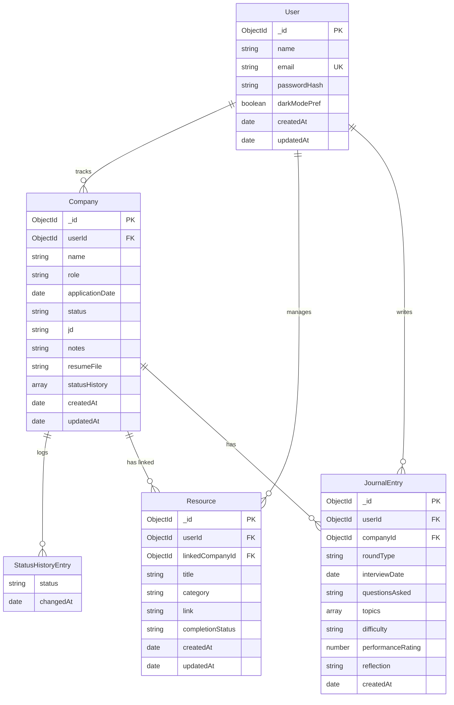
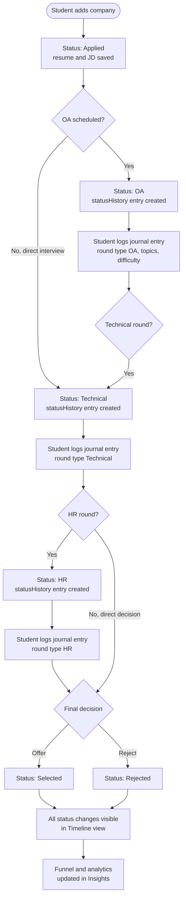
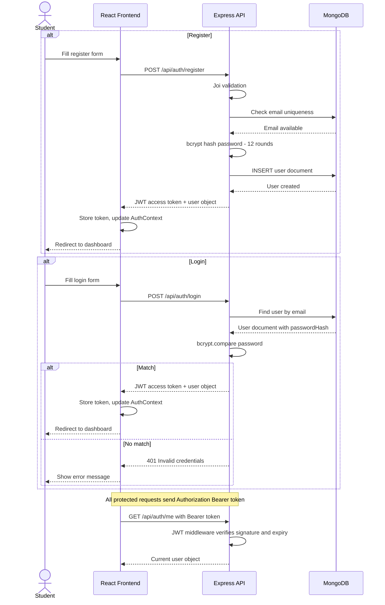
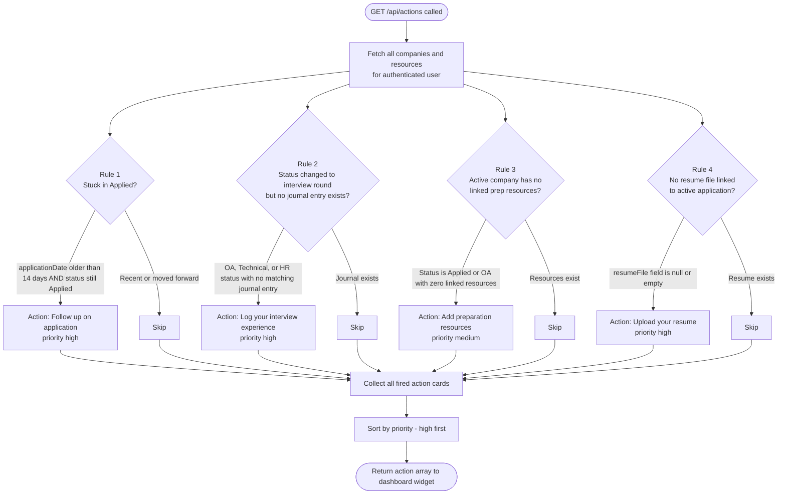
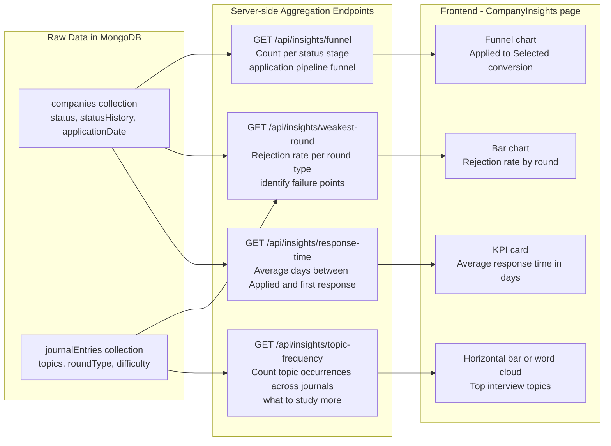

<div align="center">

<br/><br/>

<h1>Applymate.</h1>

<p><strong>A full-stack placement preparation portal — track job applications, log interview rounds, manage preparation resources, and get data-driven insights on your placement journey. Built for students who take their career seriously.</strong></p>

<br/>

<a href="https://team-catalyst-applymate.vercel.app" target="_blank">
  
</a>

<br/><br/>


<br/><br/>

</div>

---

## Table of Contents

- [Overview](#overview)
- [Live Demo](#live-demo)
- [System Architecture](#system-architecture)
- [Database Schema](#database-schema)
- [Application Lifecycle — Company Tracking](#application-lifecycle--company-tracking)
- [Authentication Flow](#authentication-flow)
- [Smart Action Center Logic](#smart-action-center-logic)
- [Insights and Analytics Pipeline](#insights-and-analytics-pipeline)
- [Features](#features)
- [Tech Stack](#tech-stack)
- [Project Structure](#project-structure)
- [Environment Configuration](#environment-configuration)
- [Getting Started](#getting-started)
- [API Reference](#api-reference)
- [Application Status Model](#application-status-model)
- [Security Model](#security-model)
- [Implementation Phases](#implementation-phases)
- [Contributing](#contributing)
- [Team](#team)
- [License](#license)

---

## Overview

Applymate is a MERN stack placement preparation portal that gives students a single, structured system to manage the chaos of campus placements. Most students track applications across spreadsheets, WhatsApp notes, and memory — Applymate replaces all of that with a purposefully designed portal that covers every phase of the placement process.

The application is organised around five core entities: Companies (the applications you are tracking), Resources (preparation material with completion status), Journal Entries (interview round logs with topic and difficulty tracking), a Timeline (chronological feed of all status changes), and Insights (aggregated analytics on your placement funnel).

Key design decisions:

- **Status history as a first-class model**: Every status change (Applied → OA → Technical → HR → Selected/Rejected) is persisted as an immutable `statusHistory` entry on the Company document. This enables the Timeline view and the Insights funnel without any data reconstruction.
- **Company-scoped resources**: Preparation resources can exist globally or be linked to a specific company, so DSA practice done before a Google interview is attributable to that application specifically.
- **Rule-based Smart Action Center**: Rather than notifications, the Action Center surfaces context-aware action cards computed on the server. Rules fire based on data conditions — a company stuck in Applied for 14+ days, a missing resume, an interview round with no journal entry. No ML, no magic — just simple business logic that surfaces what you have forgotten.
- **Server-side pagination and search**: All list endpoints accept `?page`, `?limit`, `?search`, `?status`, `?sort` query parameters, keeping the frontend stateless and the API independently cacheable.
- **TanStack Query for data fetching**: All API calls are managed through TanStack Query (React Query), providing automatic caching, background refetching, optimistic updates, and loading/error state management out of the box.

---

## Live Demo

**[team-catalyst-applymate.vercel.app](https://team-catalyst-applymate.vercel.app)**

---

## System Architecture



---

## Database Schema



---

## Application Lifecycle — Company Tracking

The full lifecycle of a placement application from creation to final outcome, including status transitions, linked resources, journal entries, and timeline events.



---

## Authentication Flow



---

## Smart Action Center Logic

The Smart Action Center computes context-aware action cards server-side using rule evaluation against live user data. No notifications, no ML — just structured business rules.



---

## Insights and Analytics Pipeline



---

## Features

### Company Application Tracker

The core module. Each company entry tracks the application role, JD link, resume file, notes, current status, and a full `statusHistory` array. Status transitions are logged automatically as immutable history entries on every `PATCH /companies/:id/status` call.

- Six-stage status pipeline: Applied, OA, Technical, HR, Selected, Rejected
- Debounced search, multi-select status filter, sort by date or name, server-side pagination
- CSV export of all applications
- Inline editing on the company detail page

### Interview Journal

A structured log of every interview round. Each entry captures the round type, date, questions asked, topics covered, difficulty rating, performance self-assessment, and a free-text reflection. Entries are linked to a specific company and accessible from the company detail page.

- Filter by company, round type, and topic tag
- Add journal entry directly from company detail with company pre-filled
- Historical journal used to power the topic frequency Insight

### Preparation Resources

A personal resource library with category classification (DSA, Aptitude, Resume, Interview Experience, Core Subjects) and three-state completion tracking (Not Started, In Progress, Completed). Resources can be global or linked to a specific company.

- Category filter and completion toggle
- Company-scoped view on the company detail page
- Completion status feeds the preparation progress charts

### Timeline

A chronological feed of all status changes across every tracked company, assembled server-side from `statusHistory` entries. Supports filtering by company, status, and date range.

### Smart Action Center

Dashboard widget showing context-aware action cards generated by server-side rule evaluation. Rules fire on data conditions: stuck applications, missing journal entries, missing resumes, and missing prep resources. Each action card links directly to the relevant page.

### Company Insights and Analytics

A dedicated analytics page with four data-driven views: application funnel conversion chart, weakest interview round bar chart, topic frequency breakdown from journal entries, and average response time KPI. All powered by MongoDB aggregation pipelines.

### Dashboard

Overview page with four KPI cards (Total Applications, Active, Offers, Rejected), a status distribution pie chart, and an applications-over-time line chart. Smart Action Center widget sits inline.

### Dark Mode

User preference toggle, stored in the MongoDB user document and in local state, applied via Tailwind's `dark:` variants.

---

## Tech Stack

### Frontend

| Technology | Version | Purpose |
|---|---|---|
| React | 18 | UI component library |
| Vite | Latest | Build tool and HMR dev server |
| React Router | v6 | Client-side routing, protected routes |
| TanStack Query | Latest | API caching, background refetch, optimistic updates |
| React Hook Form + Yup | Latest | Form state and schema validation |
| Tailwind CSS | v3 | Utility-first styling |
| Recharts | Latest | Dashboard and insights data visualisations |
| Axios | Latest | HTTP client |
| date-fns | Latest | Date formatting and comparison |
| react-icons | Latest | Icon library |

### Backend

| Technology | Version | Purpose |
|---|---|---|
| Node.js | Latest LTS | JavaScript runtime |
| Express.js | v4 | REST API framework |
| MongoDB | Latest | Primary NoSQL document database |
| Mongoose | Latest | ODM, schema validation, pre-hooks |
| JSON Web Token | Latest | Stateless authentication |
| bcryptjs | Latest | Password hashing, 12 rounds |
| Joi | Latest | Request body and query validation |
| multer | Latest | Resume file upload middleware |
| Helmet | Latest | HTTP security headers |
| express-rate-limit | Latest | Brute-force protection |
| cors | Latest | Cross-origin request configuration |
| json2csv | Latest | CSV export utility |

---

## Project Structure

```
Team-Catalyst-Applymate/
|
+-- client/                              # React 18 + Vite SPA
|   +-- src/
|   |   +-- api/                         # Axios wrapper functions per resource
|   |   |   +-- auth.js                  # register, login, getMe
|   |   |   +-- company.js               # CRUD, status update, CSV export
|   |   |   +-- resource.js              # CRUD, completion toggle, link to company
|   |   |   +-- journal.js               # CRUD, filter
|   |   |   +-- timeline.js              # GET with filters
|   |   |   +-- insights.js              # All four insight endpoints
|   |   |   +-- actions.js               # Smart Action Center
|   |   +-- components/                  # Reusable UI components
|   |   |   +-- CompanyCard.jsx
|   |   |   +-- StatusBadge.jsx
|   |   |   +-- ActionCard.jsx
|   |   |   +-- TimelineEntry.jsx
|   |   |   +-- ResourceItem.jsx
|   |   |   +-- ProgressBar.jsx
|   |   |   +-- Navbar.jsx
|   |   |   +-- ProtectedRoute.jsx
|   |   +-- pages/
|   |   |   +-- Dashboard.jsx            # KPIs, charts, Action Center
|   |   |   +-- CompanyList.jsx          # Search, filter, paginated table
|   |   |   +-- CompanyDetail.jsx        # Tabbed company detail view
|   |   |   +-- CompanyForm.jsx          # Create and edit form
|   |   |   +-- ResourcesList.jsx        # Global resource library
|   |   |   +-- JournalList.jsx          # Journal entry list with filters
|   |   |   +-- JournalForm.jsx          # Create and edit journal entry
|   |   |   +-- Timeline.jsx             # Chronological status feed
|   |   |   +-- PreparationProgress.jsx  # Category progress charts
|   |   |   +-- CompanyInsights.jsx      # Analytics and funnel charts
|   |   |   +-- Profile.jsx              # Edit name, email, password
|   |   |   +-- Login.jsx
|   |   |   +-- Register.jsx
|   |   +-- context/
|   |   |   +-- AuthContext.jsx          # Global auth state, login, logout
|   |   +-- hooks/
|   |   |   +-- useCompanies.js          # TanStack Query hooks per resource
|   |   |   +-- useResources.js
|   |   |   +-- useJournal.js
|   |   |   +-- useInsights.js
|   |   +-- utils/
|   |       +-- formatDate.js
|   |       +-- statusColors.js
|   +-- vite.config.js                   # API proxy config
|   +-- tailwind.config.js
|
+-- server/                              # Node.js + Express API
|   +-- controllers/
|   |   +-- authController.js
|   |   +-- companyController.js         # CRUD, status update, CSV export
|   |   +-- resourceController.js        # CRUD, completion toggle
|   |   +-- journalController.js
|   |   +-- timelineController.js        # Aggregated statusHistory feed
|   |   +-- insightsController.js        # Four aggregation pipelines
|   |   +-- actionsController.js         # Smart Action Center rule engine
|   +-- middleware/
|   |   +-- authMiddleware.js            # JWT verify, attach req.user
|   |   +-- validate.js                  # Joi schema middleware factory
|   |   +-- upload.js                    # multer resume upload config
|   |   +-- errorHandler.js              # Centralised error formatting
|   +-- models/
|   |   +-- User.js
|   |   +-- Company.js                   # statusHistory embedded array, pre-hooks
|   |   +-- Resource.js
|   |   +-- JournalEntry.js
|   +-- routes/
|   |   +-- auth.js
|   |   +-- company.js
|   |   +-- resource.js
|   |   +-- journal.js
|   |   +-- timeline.js
|   |   +-- insights.js
|   |   +-- actions.js
|   +-- utils/
|   |   +-- generateToken.js
|   |   +-- csv.js                       # json2csv export helper
|   |   +-- db.js                        # Mongoose connection setup
|   +-- server.js                        # App entry point, middleware chain
|
+-- IMPLEMENTATION_PLAN.md
+-- FRONTEND_MASTER_PROMPT.md
+-- PRD.md
+-- .gitignore
+-- LICENSE
+-- README.md
```

---

## Environment Configuration

### Server — `server/.env`

```env
# Database
MONGODB_URI=mongodb+srv://<user>:<password>@cluster.mongodb.net/applymate

# Authentication
JWT_SECRET=your-minimum-64-character-secret-key-change-in-production
JWT_EXPIRE=7d

# Server
PORT=5000
NODE_ENV=development

# CORS
CLIENT_ORIGIN=http://localhost:5173

# File Upload
UPLOAD_PATH=./uploads
MAX_FILE_SIZE_MB=5
```

### Client — `client/.env`

```env
VITE_API_URL=http://localhost:5000
```

> In development, the Vite proxy in `vite.config.js` forwards `/api/*` to the backend, so `VITE_API_URL` is primarily used in production builds. Never commit either `.env` file. Use `.env.example` templates for documentation.

---

## Getting Started

### Prerequisites

| Requirement | Version |
|---|---|
| Node.js | v18+ |
| npm | v9+ |
| MongoDB | Atlas or local v6+ |

### Installation

```bash
# Clone the repository
git clone https://github.com/hardikkaurani/Team-Catalyst-Applymate.git
cd Team-Catalyst-Applymate

# Install server dependencies
cd server
npm install
cp .env.example .env
# Fill in MONGODB_URI and JWT_SECRET

# Install client dependencies
cd ../client
npm install
cp .env.example .env
```

### Running the Application

```bash
# Terminal 1 — Backend
cd server
npm run dev
# Express server on http://localhost:5000

# Terminal 2 — Frontend
cd client
npm run dev
# Vite dev server on http://localhost:5173
```

Or run both concurrently from the root using `concurrently`:

```bash
npm run dev
```

### Service URLs

| Service | URL |
|---|---|
| Frontend | http://localhost:5173 |
| Backend API | http://localhost:5000 |
| API Health | http://localhost:5000/api/health |

---

## API Reference

All endpoints are prefixed with `/api`. Protected routes require:

```
Authorization: Bearer <jwt_token>
```

### Authentication

| Method | Endpoint | Auth | Description |
|---|---|---|---|
| `POST` | `/api/auth/register` | No | Register new user account |
| `POST` | `/api/auth/login` | No | Login, returns JWT |
| `GET` | `/api/auth/me` | Yes | Get authenticated user profile |

### Companies

| Method | Endpoint | Auth | Description |
|---|---|---|---|
| `GET` | `/api/companies` | Yes | List companies with search, filter, sort, pagination |
| `POST` | `/api/companies` | Yes | Create new company application |
| `GET` | `/api/companies/:id` | Yes | Get company detail with statusHistory |
| `PUT` | `/api/companies/:id` | Yes | Update company fields |
| `PATCH` | `/api/companies/:id/status` | Yes | Update status, append to statusHistory |
| `DELETE` | `/api/companies/:id` | Yes | Delete company and linked data |
| `GET` | `/api/companies/export/csv` | Yes | Download all companies as CSV |

**Query parameters for list:**

```
?search=google&status=OA,Technical&sort=applicationDate&order=desc&page=1&limit=10
```

### Resources

| Method | Endpoint | Auth | Description |
|---|---|---|---|
| `GET` | `/api/resources` | Yes | List all resources with category filter |
| `POST` | `/api/resources` | Yes | Create resource |
| `PUT` | `/api/resources/:id` | Yes | Update resource |
| `PATCH` | `/api/resources/:id/completion` | Yes | Toggle completion status |
| `DELETE` | `/api/resources/:id` | Yes | Delete resource |
| `GET` | `/api/resources/progress` | Yes | Completion percentage per category |

### Journal

| Method | Endpoint | Auth | Description |
|---|---|---|---|
| `GET` | `/api/journal` | Yes | List entries with company, round, topic filters |
| `POST` | `/api/journal` | Yes | Create journal entry |
| `GET` | `/api/journal/:id` | Yes | Get single entry |
| `PUT` | `/api/journal/:id` | Yes | Update entry |
| `DELETE` | `/api/journal/:id` | Yes | Delete entry |

### Timeline

| Method | Endpoint | Auth | Description |
|---|---|---|---|
| `GET` | `/api/timeline` | Yes | Aggregated status change feed with filters |

### Insights

| Method | Endpoint | Auth | Description |
|---|---|---|---|
| `GET` | `/api/insights/funnel` | Yes | Application pipeline funnel data |
| `GET` | `/api/insights/weakest-round` | Yes | Rejection rate per interview round |
| `GET` | `/api/insights/topic-frequency` | Yes | Most frequent interview topics from journals |
| `GET` | `/api/insights/response-time` | Yes | Average days from Applied to first response |

### Smart Actions

| Method | Endpoint | Auth | Description |
|---|---|---|---|
| `GET` | `/api/actions` | Yes | Computed action cards for dashboard |

---

## Application Status Model

| Status | Meaning | Transitions To |
|---|---|---|
| `Applied` | Application submitted | OA, Technical, HR, Rejected |
| `OA` | Online Assessment scheduled or completed | Technical, Rejected |
| `Technical` | Technical interview round | HR, Rejected |
| `HR` | HR round | Selected, Rejected |
| `Selected` | Offer received | Terminal |
| `Rejected` | Application closed | Terminal |

Every status transition is persisted as an immutable entry in the `statusHistory` array with the new status value and a `changedAt` timestamp. This array is the source of truth for the Timeline view and the Insights funnel aggregation.

---

## Security Model

| Control | Implementation |
|---|---|
| Password hashing | bcryptjs with 12 salt rounds |
| Authentication | JWT signed with HS256, configurable expiry |
| Route protection | JWT middleware on all non-auth routes |
| HTTP headers | Helmet sets Content-Security-Policy, X-Frame-Options, HSTS |
| CORS | Strict origin allowlist via `CLIENT_ORIGIN` env variable |
| Request validation | Joi schema validation on all POST/PUT bodies |
| File upload safety | multer limits file size and restricts MIME types to PDF |
| Rate limiting | express-rate-limit on all routes, stricter on `/api/auth/login` |
| Error sanitisation | Stack traces stripped in `NODE_ENV=production` |

---

## Implementation Phases

The project was built across 11 structured phases, each with a clear scope and verification criteria.

| Phase | Scope | Status |
|---|---|---|
| Phase 0 | Project setup, tooling, MERN skeleton, health check | Done |
| Phase 1 | Authentication — register, login, JWT middleware, ProtectedRoute | Done |
| Phase 2 | Company CRUD, dashboard KPIs, basic search and filter | Done |
| Phase 3 | Debounced search, multi-select filters, pagination enhancements | Done |
| Phase 4 | Preparation resources — CRUD, completion status, company linking | Done |
| Phase 5 | Company detail page — tabbed view, resume upload, status history display | Done |
| Phase 6 | Status history logging, Timeline view with filters | Done |
| Phase 7 | Interview Journal — CRUD, round type, topics, difficulty, reflection | Done |
| Phase 8 | Preparation progress — category-level completion percentages | Done |
| Phase 9 | Smart Action Center — rule-based action card generation | Done |
| Phase 10 | Company Insights — funnel, weakest round, topic frequency, response time | Done |
| Phase 11 | Polish — dark mode, profile page, responsiveness, a11y, security hardening | Done |

---

## Contributing

```bash
git checkout -b feat/your-feature-name
git commit -m "feat(module): describe your change"
git push origin feat/your-feature-name
# Open a Pull Request against main
```

Follow [Conventional Commits](https://www.conventionalcommits.org/). All controllers must include Joi validation. All new pages must be wrapped in the `ProtectedRoute` component.

---

> Update this table with the correct GitHub usernames of your teammates.

---

## License

MIT License. See [LICENSE](LICENSE) for details.

---

<div align="center">

*Applymate — built so you never lose track of where you stand.*

**[team-catalyst-applymate.vercel.app](https://team-catalyst-applymate.vercel.app)**

</div>
